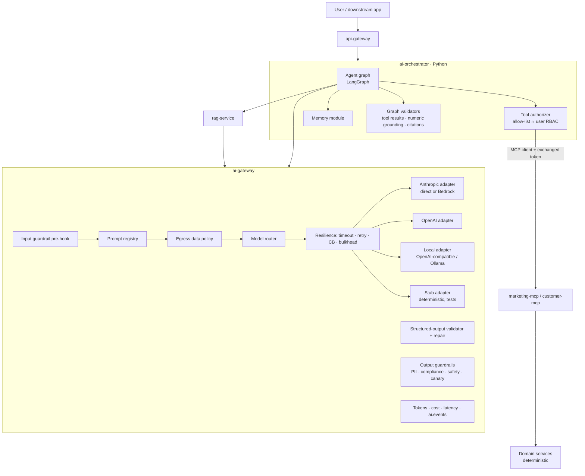
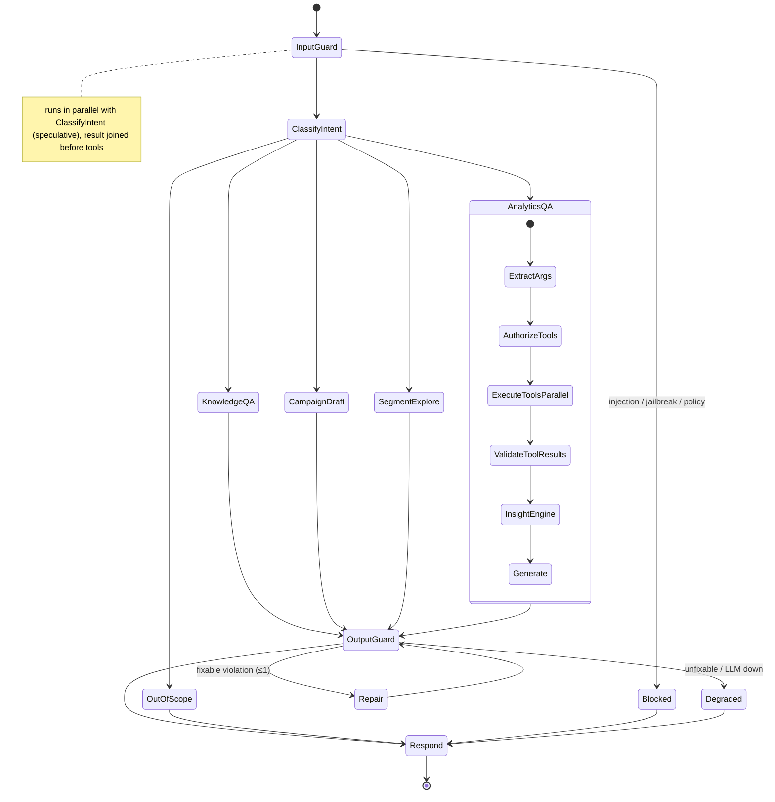

# AI Architecture

Status: Phase 0 design. This file covers the AI gateway, prompts, structured output, RAG, agents, tools, MCP, A2A, memory, guardrails, evaluation, latency and cost. In later phases it will be split into `rag.md`, `agents.md` and `mcp.md` once those have implementation detail.

**Non-negotiable rule:** the system prompt is **not** a security boundary. Every control below is enforced in code, outside the model.

## 1. Layered view



## 2. AI Gateway

**API (internal only; clients authenticate with service credentials):**
- `POST /internal/v1/completions` `{useCase, promptId, promptVersion?, variables, dataClassifications[], outputSchemaRef?, stream?, budgetContext{tenantId, campaignId?}}`
- `POST /internal/v1/embeddings` (external embedding models only; the local ONNX model runs inside rag-service)

Callers never send raw prompt strings. They send a **prompt reference + variables**. This lets the gateway enforce prompt versioning, egress policy per variable and caching.

### 2.1 Model routing

Routing table (config, per environment):

| Use case | Tier | Primary (example IDs, configurable) | Fallback 1 | Final fallback |
|---|---|---|---|---|
| `intent_classification` | SMALL | `claude-haiku-4-5` | local small model | rule-based keyword classifier |
| `injection_classifier` | SMALL | `claude-haiku-4-5` | local | heuristics only (stricter thresholds) |
| `query_rewrite` | SMALL | `claude-haiku-4-5` | local | original query |
| `campaign_generation` | LARGE | `claude-sonnet-5` | OpenAI large model | template content (deterministic) |
| `marketing_analytics` | LARGE | `claude-sonnet-5` | OpenAI large model | facts-only response |
| `rag_answer` | MEDIUM/LARGE | `claude-sonnet-5` | OpenAI | top passages with citations, no synthesis |
| `customer_personalization` | SMALL | local or `claude-haiku-4-5` | — | approved template |
| `compliance_review` | LARGE, **different family from the generator** | OpenAI large model | `claude-sonnet-5` | deterministic rules only → route to human |
| `eval_judge` | LARGE, different family from the system under test | configurable | — | — |

Routing inputs, applied in order:
1. **Egress policy.** If a request carries data classes an external provider may not receive, only providers approved for that class are eligible (e.g. local only).
2. **Tenant budget.** When the daily budget is exhausted, drop one tier or go straight to the deterministic fallback.
3. **Health.** Skip providers whose circuit breaker is open.
4. **Tier preference.**

The chosen route and reason are recorded (`ai.route.reason`).

### 2.2 Resilience defaults

| Setting | SMALL | LARGE |
|---|---|---|
| Connect / request timeout | 2 s / 8 s | 2 s / 45 s (TTFT watchdog 6 s when streaming) |
| Retries | 1 on 429/5xx/timeout, jittered backoff, honoring `retry-after` | 1 |
| Circuit breaker | 50 % failures over 20 calls → open 30 s | same |
| Bulkhead | 64 concurrent | 32 concurrent per provider |

HTTP clients use pooled connections (HTTP/2 where supported) with keep-alive.

### 2.3 Prompt registry and versioning

Prompts are **files in git** under `ai/prompts/<promptId>/<version>/`:

```
ai/prompts/campaign_generation/v2/
  prompt.yaml          # metadata: id, version, useCase, tier, temperature, maxTokens, outputSchema, owner, changelog
  system.md            # role, rules, refusal policy (static → provider prompt caching)
  context.md.hbs       # business context template (brand rules, policy excerpts), escaped variables
  user.md.hbs          # user input slot, always wrapped in <user_input> delimiters
  output.schema.json   # JSON Schema (draft 2020-12)
  examples.jsonl       # few-shot examples (optional)
```

- The registry loads prompts at startup, computes a content hash per version, and exposes `GET /internal/v1/prompts`.
- The **active version per environment** is config (`ai.prompts.active.campaign_generation=v2`). Changing it is a PR, which triggers the eval gate (§9).
- Prompt sections are assembled **static-first** (system, then stable context), so the provider-side prompt cache hits on the prefix.
- Retrieved documents and tool results are inserted inside explicit data delimiters (`<retrieved_document id=… trust="untrusted">`), with an instruction that content inside data blocks is information, never instructions.

### 2.4 Structured output

1. Request JSON output (the provider's native JSON/schema mode where available, otherwise schema in prompt).
2. Validate with a JSON Schema validator (networknt). Then run **semantic validators** per use case: channel enum, length limits per channel, and slot allow-list.
3. On failure: one **repair** call (small model, given the invalid JSON plus validator errors, asked only to fix structure). Then one **full retry** at temperature 0. If it still fails, reject with `AI_OUTPUT_INVALID`, record `schema_valid=false, repair_attempts=n`, and let the caller take the deterministic fallback.

### 2.5 AI data egress policy

Every template variable is declared with a **data class** in `prompt.yaml`:

| Class | Examples | External provider | Local model |
|---|---|---|---|
| `PUBLIC` | policy text, product copy | ✔ | ✔ |
| `INTERNAL` | campaign names, aggregate metrics | ✔ (enterprise zero-retention terms assumed and documented) | ✔ |
| `CUSTOMER_AGGREGATE` | segment sizes, k-anonymous (k ≥ 20) breakdowns | ✔ | ✔ |
| `CUSTOMER_PSEUDONYMOUS` | one customer's feature buckets (e.g. "travel affinity: high") | configurable per tenant, default ✖ | ✔ |
| `PII` | name, email, phone, exact DOB | ✖ **never** | ✖ (slots are filled after generation) |
| `SECRET` | credentials, tokens | ✖ | ✖ |

The gateway rejects a request whose declared classes are not permitted for the routed provider. It also runs a **PII detector** (regex + checksum validators for emails, phones, PANs (Luhn), IBANs, plus a name dictionary) over the rendered prompt as defense in depth. On a detection it redacts and records `egress_policy_result=REDACTED`, or blocks if the prompt's policy is `strict`.

## 3. RAG

### 3.1 Ingestion pipeline (async, `knowledge.document.events`)

```
upload (API, role MARKETING_ADMIN/AI_OPERATOR) → S3 original + document_versions(INGESTING)
 → parse (Markdown/HTML/PDF via Apache Tika; tables kept as Markdown)
 → sanitize (strip scripts/hidden text; indirect-injection scan → flag, quarantine if high)
 → chunk (structure-aware: split by headings, then ~400 tokens with 60-token overlap; keep heading_path)
 → metadata (documentId, documentType, version, source, createdAt, updatedAt, accessLevel, allowedRoles, tenant, businessDomain, effectiveFrom)
 → embed (batch, cached by sha256(text))
 → write chunks to Postgres (authoritative) → bulk index OpenSearch
 → flip version ACTIVE, previous version SUPERSEDED (atomic in DB; search filters status=ACTIVE)
```

Re-ingesting identical content (same sha256) is a no-op. Superseded versions stay queryable for audit ("what did the policy say on date X") through an explicit `asOf` parameter.

### 3.2 Retrieval pipeline

```mermaid
flowchart LR
  Q[Query] --> QR[Query rewrite<br/>optional, small model]
  QR --> F[Authorization filter<br/>tenant ∈ {caller, platform} ∧ allowed_roles ∩ caller roles ∧ status=ACTIVE ∧ metadata filters]
  F --> BM[BM25 top-50]
  F --> KNN[k-NN top-50]
  BM & KNN --> FUSE[Hybrid fusion<br/>OpenSearch normalization / RRF]
  FUSE --> RR[Cross-encoder rerank top-20 → top-k]
  RR --> TH[Relevance threshold<br/>drop < τ; if none left → "no grounded answer"]
  TH --> CTX[Context builder<br/>dedup, merge adjacent chunks, token budget]
  CTX --> OUT[Passages + citations]
```

- **Authorization is a filter inside the search query**, not post-filtering. Post-filtering leaks through ranking and counts, and it can silently return fewer results.
- Relevance threshold τ is calibrated on the golden set (Phase 13). Below-threshold results produce an explicit "I don't have an approved source for that" response, not an ungrounded answer.
- **Citations**: every passage carries `[documentId@version#chunkOrdinal]`. The output validator requires each claim sentence in a RAG answer to reference ≥1 citation that was actually in the context, and it strips citations that were not.
- **Fallback**: if OpenSearch is unavailable, use Postgres `tsvector` search with the same authorization predicates in SQL, with `retrievalMode=KEYWORD_FALLBACK`.
- Latency levers: query embedding cache, a parallel BM25 ∥ k-NN inside one hybrid query, rerank only the top 20, and an ONNX cross-encoder on virtual threads.

## 4. Agents

### 4.1 Why a graph, and why not "one big ReAct loop"

Free-running ReAct loops are hard to bound: they have unbounded tool calls, their latency and cost are unpredictable, and the tool choice is implicit. The platform uses **explicit state graphs**. Nodes are code. The LLM is used at specific nodes (classification, argument extraction, generation). Edges are deterministic, with conditions computed by code. Budgets: max 8 tool calls, max 3 LLM generations and max 1 repair per run, plus a wall-clock budget.

### 4.2 Copilot graph



- **Intent → tool plan is mostly deterministic.** Each intent has a declared tool set. The LLM extracts typed arguments through function calling constrained to that set. It may request one extra tool, but only from the intent's allow-list.
- **Validate tool results**: schema check, non-empty check, a staleness check (`asOf` older than SLA is flagged), and a tenant check (defense in depth: the result's tenant must equal the caller's tenant).
- **Insight engine** (deterministic Java): period-over-period deltas, lift vs baseline, a two-proportion z-test for CTR/CVR differences (reports `p` and whether n is sufficient), and segment contribution analysis. The LLM *explains* these results. It does not compute them.
- The response contract separates **facts** (with tool provenance) from **interpretations** (labeled as such) and **caveats**. Chain-of-thought is never returned. A short `reasoningSummary` is.
- **Checkpointing**: state is persisted after each node (`graph_checkpoints`), which enables human-in-the-loop interrupts (clarifying questions in campaign drafting) and resume after pod restarts.

### 4.3 Campaign generation graph

See [architecture.md §8.2](architecture.md). The nodes are: ExtractBrief → CheckRequiredFields → (Interrupt: ask user) → ParallelContext {segment, offers, policies, brand} → ValidateOfferForSegment (deterministic) → GenerateVariants → ComplianceReview (A2A) → CreateDraft → Respond. Content that fails compliance is regenerated at most once, with the findings as feedback. It is never auto-approved.

### 4.4 Multi-agent (A2A) — only where independence adds value

| Agent | Why it is separate |
|---|---|
| **Copilot (supervisor)** | Owns the conversation and routing |
| **Analytics agent** | Own toolset (metrics) and own prompt family. Reusable from the dashboard's "Explain" button without the chat context |
| **Campaign agent** | Own toolset, the only agent allowed to call `createCampaignDraft` |
| **Compliance agent** | **Independence**: a reviewer must not share the generator's context, prompt or model family (self-review bias). Deterministic rule pack first, then the LLM reviewer. It can add findings but cannot remove deterministic FAILs |

Agents are subgraphs in the same deployable (in-process calls, shared nothing but typed messages). The **Compliance agent is also exposed over A2A** (agent card at `/.well-known/agent-card.json`, task API) so campaign-service's human editing flow and external teams can request reviews. If needed, the other agents can be split out without changing their contracts. A "recommendation agent" is deliberately **not** created, because recommendations are deterministic (offer-service).

## 5. Tools

| Tool | Server | Backing API | Permission | Timeout | Side effects |
|---|---|---|---|---|---|
| `searchCampaigns` | marketing | campaign-service | `campaign:read` | 2 s | none |
| `getCampaign` | marketing | campaign-service | `campaign:read` | 2 s | none |
| `getCampaignMetrics` | marketing | analytics-service | `analytics:read` | 3 s | none |
| `compareCampaigns` | marketing | analytics-service | `analytics:read` | 3 s | none |
| `getSegmentBreakdown` | marketing | analytics-service | `analytics:read` | 3 s | none |
| `getEligibleOffers` | marketing | offer-service (catalog for a *segment*, not for an individual) | `offer:read` | 2 s | none |
| `validateOfferForSegment` | marketing | offer-service | `offer:read` | 2 s | none |
| `searchMarketingKnowledge` | marketing | rag-service | `knowledge:read` (+ ACL) | 2 s | none |
| `createCampaignDraft` | marketing | campaign-service | `campaign:draft` | 3 s | Creates a **DRAFT** only. The server forces `status=DRAFT, origin=AI_ASSISTED` |
| `getCustomerSegment` | customer | segmentation-service | `segment:read` | 2 s | none |
| `getSegmentProfileSummary` | customer | segmentation + customer (k-anonymous aggregates) | `segment:read` | 3 s | none |
| `getCustomerProfile` | customer | customer-service (**masked**: features and pseudonymous ID, no contact PII) | `customer:profile:read` | 2 s | none |

Every tool has:
- a JSON Schema for its input, with enums, bounds, ID formats and max lengths;
- authentication (a bearer token audience-bound to the MCP server) and authorization (scope + role, checked in the MCP server *and* again by the domain service);
- input validation that rejects anything not in the schema (no free-text filters that could become queries);
- a timeout;
- per-user rate limits (Redis);
- an audit event (tool, caller, on-behalf-of, args hash, outcome);
- typed errors (`TOOL_UNAUTHORIZED`, `TOOL_INVALID_ARGS`, `TOOL_TIMEOUT`, `TOOL_UPSTREAM_ERROR`).

**No tool accepts SQL, a URL or a file path.** There is deliberately no `publishCampaign`, `approveCampaign`, `updateOffer` or `setEligibility` tool.

## 6. MCP

- **Servers:** `marketing-mcp-server` (toolsets `campaign`, `offer`, `analytics`, `knowledge`) and `customer-mcp-server`.
- **Transport:** Streamable HTTP, behind the ALB/WAF, not through the api-gateway, because it uses its own OAuth resource metadata.
- **Auth:** MCP servers are OAuth 2.1 resource servers (Keycloak authorization server). They publish Protected Resource Metadata, validate token audience = their own resource URI, and never pass the client's token through to downstream services. Downstream calls use a token-exchanged token for the same user (confused-deputy protection).
- **Allow-lists:** per OAuth client (e.g. `ai-orchestrator` gets all tools, `external-ide-client` gets read-only tools), intersected with the user's role permissions.
- **Resources:** `policy://marketing/{documentId}` (policies, guidelines), `offers://approved?category=` (approved offer catalogue, read-only) and `campaign-docs://{campaignId}`. Resources are ACL-filtered the same way as RAG.
- **Prompts:** `campaign_generation`, `campaign_analysis`, `customer_engagement`. These are served from the same prompt registry files (single source of truth).
- **Validation, rate limiting and audit** match §5. Tool descriptions are static strings in code and are reviewed like code, which prevents tool-description poisoning.

## 7. Memory

| Type | Store | Content | TTL | Controls |
|---|---|---|---|---|
| Short-term | Redis `conv:{id}:msgs` | Last 12 turns, **redacted**. Older turns are replaced by a running summary (small model) | 24 h sliding | Tenant + user bound. Deleted with the conversation |
| Long-term | Postgres `user_memories` | **Allow-listed preference keys only** (e.g. default channel, preferred chart style), each explicitly confirmed by the user in the UI | 180 d | User can list/delete (`GET/DELETE /api/v1/ai/memory`). Audited |
| Semantic | OpenSearch `semantic-memory` | Embeddings of approved long-term memories for relevance-based recall | same as source row | Filtered by tenant + user. Deleted in the same operation as the source row |

Never stored: PII, customer-level data, raw tool results, anything from retrieved documents. A deletion request removes all three tiers and emits an audit event. A nightly job reconciles orphans.

## 8. Guardrails

The content guardrail engine is a module of **ai-gateway** (Java), and its rule packs are versioned config in `ai/guardrails/`. It runs as a pre-hook (input checks) and post-hook (output checks) on completions according to each prompt's `guardrails` policy. It is also exposed as `POST /internal/v1/guardrails/check` for content produced outside a completion. Checks that need graph state (tool-result validation, numeric grounding, citation grounding) run in the orchestrator.

| Stage | Check | Technique | On violation |
|---|---|---|---|
| Input | Size/charset | Max 4 k chars, control-char stripping | 400 |
| Input | Prompt injection / jailbreak | Heuristic rules (instruction override phrases, role-play markers, encoding tricks such as base64 or zero-width chars) **+** a small-model classifier with a calibrated threshold | Block + audit `AI_INPUT_BLOCKED` |
| Input | PII in user prompt | Detector (§2.5) | Redact before the LLM and memory |
| Retrieval | Indirect injection in documents | Ingestion-time scan and quarantine. Runtime data delimiters. Retrieved text is never allowed to trigger tools (tool calls come only from the plan) | Drop the chunk and flag the document |
| Tool | Unauthorized tool | Allow-list ∩ RBAC before the call, then MCP server and domain service re-check | Deny + audit `AI_TOOL_DENIED` |
| Tool | Malicious tool args | JSON Schema + semantic validation (IDs must exist and belong to the tenant) | Reject |
| Output | Schema | §2.4 | Repair / reject |
| Output | Numeric grounding | Every number in the narrative must match a fact (tolerance for rounding/percent formatting) | Repair once, else facts-only |
| Output | Citation grounding | Claims need valid citations from the provided context | Strip / repair / "no grounded answer" |
| Output | Compliance & brand | Deterministic rule pack: prohibited claims ("guaranteed", "risk-free", "free money"), mandatory disclosures per offer type, no APR/credit claims, tone and length per channel | FAIL → regenerate once → human |
| Output | Sensitive-data leak | PII detector, secret patterns, system-prompt canary token (a leaked canary indicates prompt extraction) | Block + audit |
| Output | Unsafe content | Moderation classifier (small model) plus a denylist | Block |

The guardrail result is recorded per request (`ai.guardrail.result`, violations by rule id) and surfaced on the AI dashboard.

## 9. Evaluation

### 9.1 Golden datasets (`ai/datasets/*.jsonl`, versioned in git)

| Dataset | Target size | Fields |
|---|---|---|
| `rag_qa` | 80 | query, role, expectedAnswer, expectedDocumentIds, relevantChunkIds (graded 0–3), mustRefuse |
| `analytics_qa` | 40 | query, seededDataFixture, expectedTools, expectedFacts, forbiddenClaims |
| `tool_selection` | 60 | query, role, expectedTools (set), expectedDeniedTools |
| `campaign_generation` | 25 | brief, expectedSegment, expectedOffer, requiredDisclosures, outputSchema |
| `personalization` | 25 | offer, featureBuckets, forbiddenFacts |
| `adversarial` | 100 | attack (direct/indirect injection, jailbreak, exfiltration, tool abuse), expectedOutcome=BLOCK/SAFE_REFUSAL |

Data fixtures are deterministic, generated by `data-generator --seed`, so the "expected facts" are exact.

### 9.2 Metrics

- **Retrieval** (deterministic): Precision@k, Recall@k, MRR and NDCG@k over graded relevance.
- **Tools**: exact-set accuracy, precision/recall of tool selection, and argument validity rate.
- **Generation**: schema validity, numeric grounding rate, citation precision (deterministic); correctness, relevance, groundedness/faithfulness (LLM judge with rubric, judge model from a different family, **judge agreement measured against ~50 human-labeled cases** and reported).
- **Safety**: attack success rate (must be 0 on the critical subset) and over-refusal rate on benign cases.
- **Operational**: p50/p95 latency, tokens, cost per case, and error rate.

### 9.3 Regression gate (CI)

```
change in ai/prompts | ai/guardrails | model routing config | rag chunker/retrieval code
  → PR job "ai-eval":
     1. deterministic suites (retrieval metrics with local ONNX embeddings, guardrail heuristics, schema) — always, no secrets
     2. live-model suites (generation, tool selection, adversarial) — protected environment with API keys, budget cap
     3. compare vs approved baseline (eval_baselines): fail if any metric < floor OR drops > tolerance
        (e.g. NDCG@5 −0.02, groundedness −0.03, attack success > 0, schema validity < 0.99)
     4. LLM-judged metrics use 3 samples per case; the comparison uses the mean, with a bootstrap CI to avoid flaky gates
  → report posted as PR comment + artifact
nightly: full suites on main; results feed the AI evaluation dashboard
online: evaluation-service samples 2 % of production ai.events (metadata only + opt-in stored payloads) for judge scoring
```

A new baseline must be approved by an `AI_OPERATOR`, and the approval is audited. A PR cannot lower its own baseline.

## 10. Latency optimization

| Lever | Where |
|---|---|
| Parallel independent tools (LangGraph parallel branches / `asyncio.gather` with per-tool timeouts) | Orchestrator ExecuteToolsParallel |
| Speculative parallelism: input guard ∥ intent classification | Copilot graph |
| Small models for classification/rewrite/judging simple checks | Router tiers |
| Provider prompt caching (static-first prompt layout) | Prompt registry |
| Exact-match response cache (non-personalized, temperature 0) | ai-gateway / Redis |
| Embedding + retrieval caches | rag-service |
| Context reduction: rerank, then keep top-k within a token budget; tool results are summarized to the fields the prompt needs (projection, not LLM summarization) | rag-service, orchestrator |
| Streaming (SSE) for chat narratives, with a sentence-level output check and a final full check. Campaign generation is **not** streamed (it must pass guardrails as a whole) | orchestrator |
| Connection pooling, HTTP/2, keep-alive | ai-gateway |

Latency is recorded per stage: `gateway`, `guard.input`, `intent`, `retrieval.embed`, `retrieval.search`, `retrieval.rerank`, `tool.{name}`, `llm.ttft`, `llm.total`, `guard.output` and `total`.

## 11. Cost optimization and tracking

- Every call records input, output and cached tokens, model, and `cost_usd` computed from the versioned `model_prices` table. Prices are loaded from config sourced from provider price sheets and never hard-coded in code.
- Attribution: `tenant`, `useCase`, `campaignId`, `conversationId`, `userId`. Dashboards show cost per request, per campaign, per customer interaction and per tenant/day.
- Controls: tenant daily budget (soft alert 80 %, hard downgrade 100 %), per-use-case max tokens, tier routing, caching, context filtering, and **batch processing** (campaign variant generation for many segments runs through the provider batch API when latency is irrelevant).
