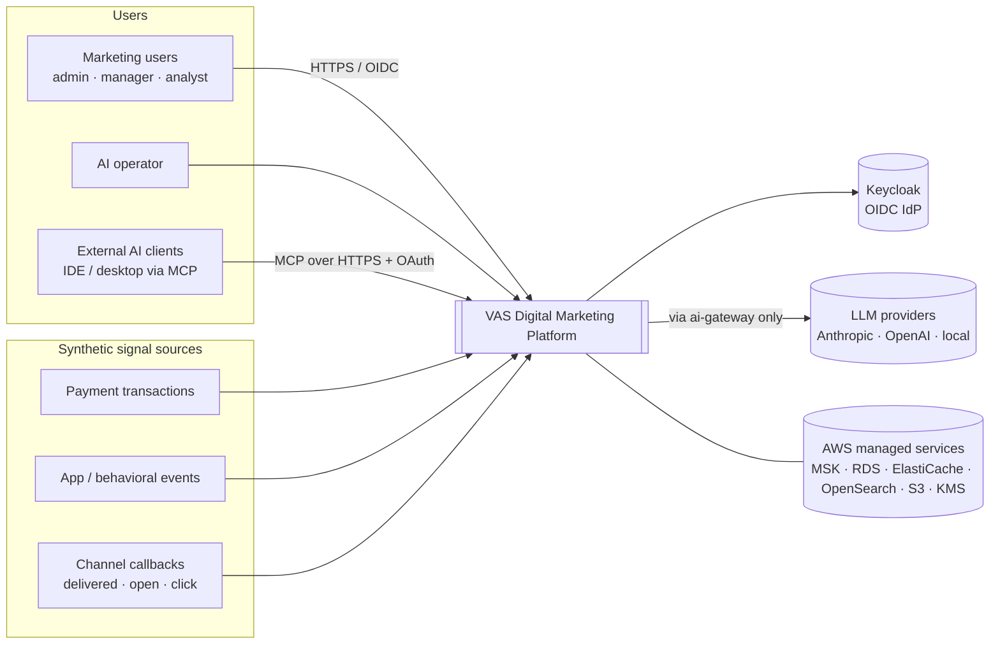
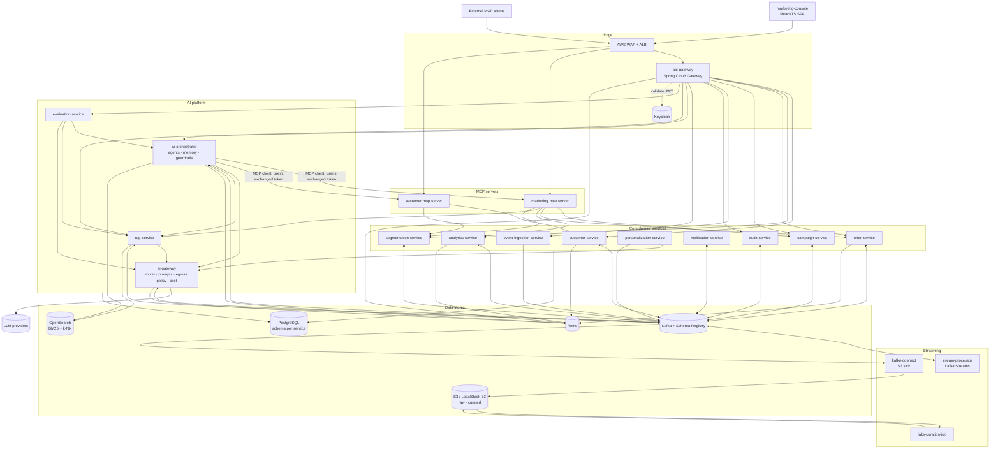
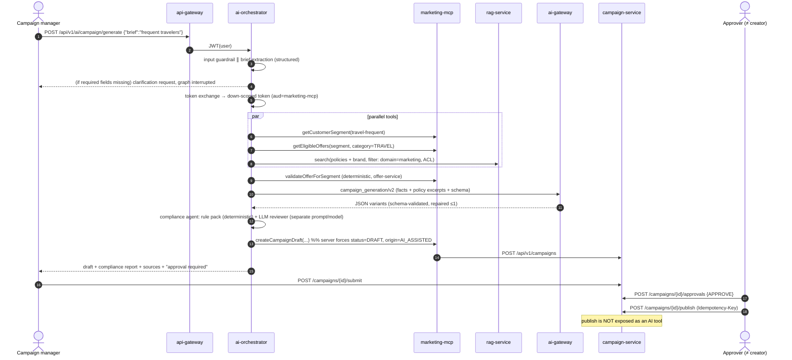
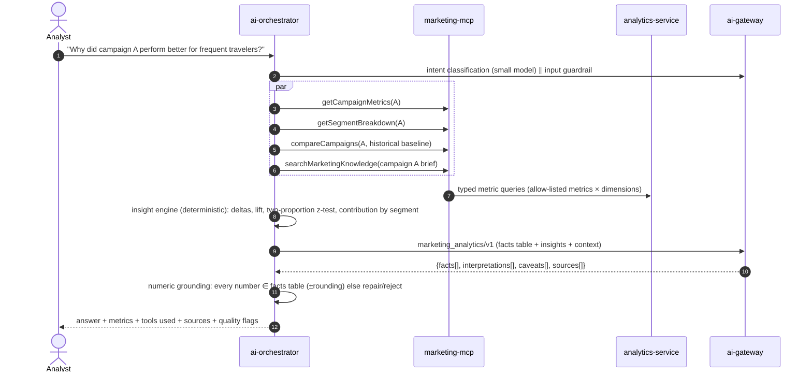

# Architecture — VAS Digital Marketing & GenAI Platform

Status: **Phase 0 — design for review.** Nothing in this document is implemented yet. Every performance or reliability number is a *target* until a later phase measures it.

Related: [data-model.md](data-model.md) · [kafka.md](kafka.md) · [api.md](api.md) · [ai-architecture.md](ai-architecture.md) · [security.md](security.md) · [roadmap.md](roadmap.md) · [decisions/](decisions/README.md)

---

## 1. Context and scope

This is a reference implementation of a digital-marketing platform of the kind a card network runs as a value-added service. **Tenants are financial institutions** (issuers). Each issuer runs campaigns for its cardholders, and the offers are funded by merchants. Every piece of data is synthetic. No proprietary Visa design is used or implied.

```
Consumers → Merchants → Financial Institutions → Payment / Behavioral Signals
  → Real-Time Data Platform → Analytics / ML → VAS Digital Marketing
  → Segmentation → Personalization → Offers / Campaigns → GenAI → Customer Engagement
```

### 1.1 Architectural principles

| # | Principle | Consequence |
|---|-----------|-------------|
| P1 | **Deterministic core, AI at the edges.** | Eligibility, pricing, limits, compliance decisions, authorization, campaign status and all metrics are computed by code. LLMs only summarize, explain, generate language, retrieve semantically and interact in natural language. (§3) |
| P2 | **The platform works without an LLM.** | Every AI-assisted flow has a deterministic fallback (templates, raw metrics, keyword search). The deterministic end-to-end slice is built *before* any AI (see roadmap). |
| P3 | **AI never has more privilege than the human it acts for.** | Agents call tools with a token-exchanged, down-scoped user token. MCP servers are the only door from AI to business data. |
| P4 | **Events are the system of integration; databases are private.** | Each service owns its schema. Cross-service data moves through Kafka (async) or versioned REST (sync reads only). |
| P5 | **Consolidate until a boundary pays for itself.** | 17 deployables, not 28. See §5 for what was merged and why. |
| P6 | **Every decision is auditable.** | State changes, eligibility decisions, AI requests, tool calls and approvals produce audit events through the transactional outbox. |
| P7 | **Local ≡ cloud, modulo scale.** | The same images, schemas and config keys run in Docker Compose, kind and EKS. Differences are declared per environment profile (§10). |

---

## 2. System context



---

## 3. Deterministic vs AI responsibility boundary (mandatory)

| Concern | Owner | Mechanism | May an LLM influence it? |
|---|---|---|---|
| Offer eligibility | offer-service | Versioned rule engine; every decision persisted with reason codes | **No** |
| Pricing / reward value / caps / budget | offer-service | Offer record plus budget ledger | **No** |
| Authorization | Keycloak + every service + MCP servers | JWT, RBAC, token exchange, data-layer filters | **No** |
| Compliance pass/fail | Compliance rules (deterministic) in guardrails | Rule packs in `ai/guardrails/` | LLM *adds* findings only; it can never turn a deterministic FAIL into a PASS |
| Campaign status transitions | campaign-service state machine | Four-eyes approval; publish requires `CAMPAIGN_MANAGER` ≠ creator | **No**. The AI tool surface has no publish tool |
| Metrics (CTR, CVR, cost …) | stream-processor → analytics-service | Windowed aggregation; SQL | **No**. Every number in AI output is checked against the tool facts |
| Segment membership | segmentation-service | Rule DSL evaluated over features | LLM may *propose* a segment definition as a draft; the system computes membership |
| Content generation | ai-orchestrator via ai-gateway | Versioned prompts, JSON schema | Yes, as drafts, gated by guardrails and human approval |
| Explanations / summaries | ai-orchestrator | Facts computed first, narrative second | Yes, with facts and interpretation labeled separately |
| Semantic retrieval | rag-service | Hybrid search + rerank + ACL | Yes (ranking), never access control |

---

## 4. Container view



---

## 5. Component responsibilities

### 5.1 Deployables

| Deployable | Responsibility (single sentence) | Owns (data) | Publishes | Consumes | Sync dependencies |
|---|---|---|---|---|---|
| **api-gateway** | Edge routing, JWT validation, per-client rate limiting, correlation-ID injection, request size limits. | none (Redis rate-limit buckets) | — | — | Keycloak JWKS |
| **customer-service** | System of record for customers (PII, encrypted), consent and preferences, merchant reference data, and the customer profile/feature read model. | `customer` schema | `merchant.reference`, `audit.events` | `customer.profile.updated` | — |
| **event-ingestion-service** | Validates, authenticates and normalizes inbound signals (transactions, behavioral events, channel beacons), then publishes them keyed by customer. | none | `transaction.events`, `customer.events`, `engagement.events` | — | Schema Registry |
| **stream-processor** | Stateful stream processing: dedup, event-time features, conversion attribution, campaign metric aggregation. | Kafka Streams state stores (RocksDB + changelog) | `customer.profile.updated`, `campaign.conversion`, `campaign.metrics`, `stream.late.events` | `transaction.events`, `customer.events`, `engagement.events`, `merchant.reference` | — |
| **segmentation-service** | Segment definitions (rule DSL), incremental and backfill membership computation, size estimates. | `segment` schema | `segment.membership.changed`, `audit.events` | `customer.profile.updated` | — |
| **offer-service** | Offer catalogue, **deterministic eligibility engine**, budget/redemption ledger. | `offer` schema | `offer.events`, `offer.eligibility.determined`, `audit.events` | `segment.membership.changed`, `campaign.conversion` | — |
| **campaign-service** | Campaign lifecycle state machine, content variants, four-eyes approval, publish. | `campaign` schema | `campaign.events`, `audit.events` | — | segmentation, offer (validation on submit) |
| **personalization-service** | Campaign activation: picks the approved content variant per customer, fills slots from authoritative data, runs constrained real-time GenAI for in-app surfaces, falls back to templates. | `personalization` schema (activation state, variant assignments) | `notification.requests`, `audit.events` | `campaign.events`, `offer.eligibility.determined`, `offer.events` | segmentation, offer, campaign, ai-gateway |
| **notification-service** | Channel adapters (simulated email/push/in-app), consent and frequency-cap enforcement at send time, delivery callbacks. | `notification` schema (send log) | `engagement.events` | `notification.requests` | customer-service (contact details, narrow scope) |
| **analytics-service** | Metric store and query API (semantic layer: allow-listed metrics × dimensions), comparisons, baselines, significance tests. | `analytics` schema | — | `campaign.metrics`, `campaign.conversion`, `engagement.events`, `campaign.events` | — |
| **audit-service** | Append-only, hash-chained audit store and query API; S3 Object Lock archival in AWS. | `audit` schema | — | `audit.events`, `ai.events` | — |
| **ai-gateway** | The **only** component with LLM credentials. Provider adapters, model routing, fallback, prompt registry and rendering, AI data-egress policy, **guardrail engine** (input and output content checks, rule packs), structured-output validation and repair, token/cost/latency accounting. | `aigw` schema | `ai.events`, `audit.events` | — | LLM providers |
| **ai-orchestrator** (Python) | Stateful agent graphs in LangGraph (copilot, campaign generation, analytics explanation, compliance review), graph-level validation (tool results, numeric and citation grounding), tool authorization, conversation memory, A2A endpoint. Content guardrails are delegated to ai-gateway. | `orchestrator` schema, Redis (short-term memory), OpenSearch (semantic memory) | `audit.events` | — | ai-gateway, MCP servers, rag-service |
| **rag-service** | Document ingestion (parse → chunk → embed → index), versioning, hybrid retrieval with ACL filtering, reranking, citations. | `rag` schema (authoritative chunks), OpenSearch indices, S3 originals | `knowledge.document.events`, `audit.events` | `knowledge.document.events` (ingest workers) | ai-gateway (external embeddings, optional) |
| **evaluation-service** (Python) | Golden datasets, offline eval runs, baseline comparison, CI gate, online sampling of production AI traffic. | `evaluation` schema | — | `ai.events` (sampling) | ai-orchestrator, rag-service, ai-gateway |
| **marketing-mcp-server** | MCP tools, resources and prompts for campaigns, offers, analytics and knowledge. | none | `audit.events` | — | campaign, offer, analytics, rag, segmentation |
| **customer-mcp-server** | MCP tools over **segment-level and masked** customer data only. Separate because it carries a higher data classification. | none | `audit.events` | — | customer, segmentation |
| **marketing-console** | React/TypeScript SPA (12 screens). | none | — | — | api-gateway |
| **kafka-connect** + **lake-curation-job** | Raw topic → S3 (Parquet, partitioned by date/hour). Raw → curated (deduped, typed, PII-free) → feature backfill inputs. | S3 `raw/`, `curated/` | — | all business topics | — |
| **data-generator** (tool, not a service) | Synthetic customers, merchants, transactions, behavioral and engagement events with realistic distributions. | — | via event-ingestion API | — | — |

### 5.2 Consolidation decisions (requested → chosen)

| Requested service | Decision | Why |
|---|---|---|
| identity-service | **Keycloak** (not custom) | Writing an OIDC provider is a security liability. Keycloak gives OIDC, RBAC, client credentials and RFC 8693 token exchange. |
| merchant-service | Module in **customer-service** | Merchants are low-write reference data consumed mostly as a compacted topic. A separate service would own one table. Split out if merchant onboarding becomes its own domain. |
| event-service | **event-ingestion-service** + **stream-processor** | Ingestion (stateless, I/O-bound, public-facing) and stream processing (stateful, CPU/disk-bound) scale and fail differently. |
| model-router, prompt-service | Modules in **ai-gateway** | Both sit on every LLM call. A network hop per call buys nothing, because they share lifecycle, config and credentials. |
| embedding-service | Module in **rag-service** (in-process ONNX), external embeddings through ai-gateway | Embedding is part of ingestion and query. The local model runs in-process. |
| memory-service | Module in **ai-orchestrator** | Only the orchestrator reads or writes memory. TTL, deletion and audit are enforced in that module. |
| guardrail-service | **Guardrail module inside ai-gateway** + rule packs in `ai/guardrails/`. Grounding checks that need graph state stay in the orchestrator | Both Java (personalization) and Python (orchestrator) callers need the same content checks, so a single engine avoids a duplicate implementation. The input check runs as a pre-hook on the first model call of a request (intent classification), so it adds no extra network hop. |
| analytics-mcp, campaign-mcp | Toolsets inside **marketing-mcp-server** | Same data classification and consumers. Toolsets are allow-listed separately. |
| customer-mcp | Kept separate: **customer-mcp-server** | Different data classification, stricter scopes and a separate blast radius. |

Result: **15 backend services + 2 MCP servers + 1 SPA + streaming/lake jobs.**

---

## 6. Technology choices

| Area | Choice | Notes / ADR |
|---|---|---|
| Language / runtime | **Java 25 (LTS)** for domain, streaming, ai-gateway, RAG and MCP services (virtual threads, no preview features). **Python 3.13** for ai-orchestrator and evaluation-service | [ADR-011](decisions/ADR-011-java25-spring-boot4.md), [ADR-022](decisions/ADR-022-polyglot-java-python.md) |
| Framework | **Spring Boot 4.0.x** (Spring Framework 7, Jackson 3), Spring Cloud 2025.1.x Gateway, Spring Security 7 resource server, Spring Kafka, Spring Data JPA/Hibernate 7, Bean Validation, Actuator, springdoc-openapi | Boot 4.0.x rather than 4.1: Spring Cloud 2025.1 (the latest GA) supports 4.0.x. Versions are pinned in the parent POM |
| Build | **Maven** multi-module with Maven Wrapper, BOM, enforcer, Spotless, Checkstyle, SpotBugs, JaCoCo, OWASP dependency-check | [ADR-012](decisions/ADR-012-maven-monorepo.md) |
| Resilience | Resilience4j (timeout, retry, circuit breaker, bulkhead, rate limiter) | |
| Messaging | **Apache Kafka** (KRaft) · Avro + Schema Registry (BACKWARD_TRANSITIVE) · MSK in AWS | [ADR-002](decisions/ADR-002-kafka-event-backbone.md), [ADR-013](decisions/ADR-013-avro-schema-registry.md) |
| Stream processing | **Kafka Streams** with exactly-once v2 | [ADR-014](decisions/ADR-014-kafka-streams.md) |
| OLTP | **PostgreSQL 17**, schema-per-service, Flyway, optimistic locking, native partitioning for high-volume tables | [ADR-015](decisions/ADR-015-postgres-schema-per-service.md) |
| Cache / ephemeral | **Redis 7** (ElastiCache) | Never authoritative (§8 of data-model) |
| Search / vectors | **OpenSearch 2.x/3.x** (BM25 + k-NN HNSW + hybrid search pipeline). Postgres FTS is the fallback | [ADR-005](decisions/ADR-005-vector-store-opensearch.md) |
| Lake | S3 (LocalStack S3 locally), Parquet, Kafka Connect S3 sink, DuckDB-based curation job locally / Athena + Glue in AWS. Redshift optional | [ADR-016](decisions/ADR-016-data-lake.md) |
| Identity | **Keycloak** (OIDC, client credentials, token exchange) | [ADR-017](decisions/ADR-017-keycloak-token-exchange.md) |
| LLM access | Own **ai-gateway** with official provider SDKs (Anthropic direct or via Bedrock, OpenAI, OpenAI-compatible local/Ollama, deterministic stub) | [ADR-006](decisions/ADR-006-llm-gateway.md) |
| Agents | **LangGraph** (Python) stateful graphs; LangChain core for model/tool interfaces (chat model adapter points at ai-gateway); `langchain-mcp-adapters` / MCP Python SDK as the MCP client | [ADR-007](decisions/ADR-007-agent-architecture.md) |
| MCP | Official MCP Java SDK (servers), Streamable HTTP transport, OAuth 2.1 resource-server auth | [ADR-008](decisions/ADR-008-mcp.md) |
| Embeddings / rerank | In-process ONNX (`all-MiniLM-L6-v2` embeddings, `ms-marco-MiniLM` cross-encoder) as the local/CI default. Provider embeddings are configurable | [ADR-004](decisions/ADR-004-rag.md) |
| Observability | Micrometer + OpenTelemetry (OTLP) → OTel Collector → Prometheus / Tempo / Loki / Grafana locally; ADOT → CloudWatch / AMP / X-Ray in AWS. Structured JSON logs | [ADR-010](decisions/ADR-010-observability.md) |
| Frontend | React 19 + TypeScript + Vite, TanStack Query, oidc-client-ts, Recharts | |
| Python stack | uv, FastAPI, Pydantic v2, httpx, ruff, mypy (strict), pytest, OpenTelemetry Python | [ADR-022](decisions/ADR-022-polyglot-java-python.md) |
| Local AWS | **LocalStack** (S3, KMS, Secrets Manager, CloudWatch Logs) + real containers for Kafka, Postgres, Redis, OpenSearch | [ADR-023](decisions/ADR-023-localstack-local-aws.md) |
| Testing | pytest for Python services; JUnit 5, Mockito, AssertJ, Testcontainers (Postgres, Kafka, Redis, OpenSearch, Keycloak), MockMvc, Spring Cloud Contract, ArchUnit, Gatling (Java DSL) | [ADR-018](decisions/ADR-018-testing-strategy.md) |
| Containers | Multi-stage builds, Eclipse Temurin 25 JRE / distroless, non-root, layered jars | |
| Orchestration | EKS, one Helm library chart plus per-service values, HPA, PDB, topology spread across AZs | [ADR-009](decisions/ADR-009-kubernetes-eks.md) |
| IaC | Terraform (modules + env roots dev/staging/prod), tflint, checkov | |
| CI/CD | GitHub Actions; Trivy (image + fs), CodeQL, dependency review, gitleaks; kind-based deploy smoke test | |

---

## 7. Hexagonal service layout (every Java service)

```
services/campaign-service/src/main/java/com/vasmarketing/campaign/
├── domain/            # Aggregates, value objects, domain events, domain services. No Spring, no JPA annotations.
│   ├── model/         # Campaign, ContentVariant, CampaignStatus (state machine), Approval
│   ├── event/         # CampaignCreated, CampaignPublished …
│   └── port/          # Outbound ports: CampaignRepository, SegmentCatalog, OfferCatalog, DomainEventPublisher
├── application/       # Use cases (one class per command/query), transactions, authorization checks
│   ├── command/       # CreateCampaign, SubmitForApproval, ApproveCampaign, PublishCampaign
│   └── query/
├── infrastructure/    # Adapters: JPA entities + mappers, Kafka outbox, REST clients (Resilience4j), config
│   ├── persistence/
│   ├── messaging/
│   └── client/
└── interfaces/        # REST controllers, DTOs, exception → ProblemDetail mapping, OpenAPI annotations
    └── rest/
```

These rules are checked by **ArchUnit** in every service:
- `domain` depends on nothing outside `domain` and the JDK.
- `interfaces` → `application` → `domain`. `infrastructure` implements `domain.port`.
- Controllers contain no business logic. JPA entities are not domain objects.
- Constructor injection only (field `@Autowired` is forbidden by an ArchUnit rule).

Shared libraries under `platform/` are **technical only** (web errors, correlation, Kafka envelope, outbox, idempotency, security config, observability, test fixtures). They must not contain domain types. Otherwise they would become a distributed monolith's shared kernel.

---

## 8. Key flows

### 8.1 Signal → features → segment → eligibility → personalized offer (Use case 1)

```mermaid
sequenceDiagram
  autonumber
  participant SRC as Signal source
  participant ING as event-ingestion
  participant K as Kafka
  participant SP as stream-processor
  participant SEG as segmentation
  participant OFF as offer-service
  participant PER as personalization
  participant AIG as ai-gateway
  participant NOT as notification
  SRC->>ING: POST /api/v1/events (idempotency-key = eventId)
  ING->>K: transaction.events (key=customerId)
  K->>SP: consume (EOS v2)
  SP->>SP: dedup(eventId) → event-time daily buckets → rolling features
  SP->>K: customer.profile.updated (compacted, key=customerId)
  K->>SEG: consume → evaluate active segment rules for this customer
  SEG->>K: segment.membership.changed (JOINED travel-frequent) [outbox]
  K->>OFF: consume → deterministic eligibility (segment, window, budget, caps, consent)
  OFF->>K: offer.eligibility.determined {eligible, reasonCodes, ruleSetVersion} [outbox]
  K->>PER: consume → is there an ACTIVE campaign for (segment, offer)?
  alt outbound channel (email/push)
    PER->>PER: pick APPROVED variant, fill slots from offer record (no LLM at send time)
  else in-app surface with real-time personalization enabled
    PER->>AIG: customer_personalization/v1 (feature buckets only, no PII)
    AIG-->>PER: JSON {headline, body, factsUsed}
    PER->>PER: policy validation: every fact == offer record; else template fallback
  end
  PER->>K: notification.requests (key=customerId)
  K->>NOT: consume → consent + frequency cap → send (simulated)
  NOT->>K: engagement.events (DELIVERED/IMPRESSION/CLICK)
```

**Why outbound content is not generated per customer at send time.** Human approval (use case 4) must cover what customers actually receive, and an LLM call per customer per message is expensive and slow. So the LLM generates a *variant set* at campaign creation, a human approves it, and send-time personalization is deterministic slot-filling plus variant selection. Real-time generation runs only on low-risk in-app surfaces, and every generated fact is verified against the offer record.

### 8.2 Campaign generation with human approval (Use case 4)



### 8.3 Analytics explanation (Use cases 2 & 5)



If the LLM is unavailable, the same request returns the facts table and deterministic insights with `narrative: null` and `degraded: true`.

---

## 9. Sync vs async map

| Interaction | Style | Reason |
|---|---|---|
| UI → services | Sync REST via gateway | User waiting |
| Signal ingestion → processing | Async (Kafka) | High volume, absorbs bursts, replayable |
| Features → segmentation → eligibility → personalization → notification | Async chain | No user waiting. Each step retries and scales independently |
| campaign-service → segmentation/offer on submit | Sync read (validation) | Needs an answer before the state transition. Circuit breaker → 503 with retry-after |
| Campaign lifecycle → personalization | Async (`campaign.events`) | Activation is a background job |
| Orchestrator → tools | Sync (MCP over HTTP), parallelized | Interactive latency |
| Audit | Async via outbox | Must never be lost, must not block |
| AI telemetry | Async (`ai.events`) + Prometheus | Evaluation sampling, cost attribution |

---

## 10. Environment profiles

| Profile | Where | Kafka | Postgres | Redis | Search | LLM | Identity | Notes |
|---|---|---|---|---|---|---|---|---|
| `local` | Docker Compose + LocalStack (S3, KMS, Secrets Manager) | 1 broker KRaft, RF=1 | 1 container, schema/service | 1 container | OpenSearch single node (512 MB heap) | `AI_PROVIDER` = `stub` (default) \| `anthropic` \| `openai` \| `bedrock` \| `ollama` | Keycloak dev realm import | Compose profiles: `core`, `ai`, `obs`, `lake` |
| `test` | Testcontainers / CI | container | container | container | container | `stub` (deterministic) + recorded fixtures | Keycloak container | Live-model eval only in a protected CI job |
| `dev` | AWS, 1 region, 2 AZ | MSK Serverless or 2×`kafka.t3.small` | RDS single-AZ `db.t4g.medium` | ElastiCache `cache.t4g.small` | OpenSearch 1 node | Bedrock / API | Keycloak on EKS | `terraform apply` only by explicit opt-in. Everything is tagged and auto-stop documented |
| `staging` | AWS, 3 AZ | MSK 3 brokers | RDS Multi-AZ | ElastiCache replicated | 3 nodes | same as prod | same | Production-like, reduced size |
| `prod` | AWS, 3 AZ | MSK 3+ brokers, RF=3, min.insync=2 | RDS Multi-AZ + PITR + cross-region snapshot copy | ElastiCache cluster mode, Multi-AZ | 3 dedicated masters + data nodes | Bedrock/API + fallback | Keycloak HA | WAF, KMS CMKs, VPC endpoints |

### 10.1 Local resource plan (this workstation: 8 GB RAM, 8 cores; Docker VM currently 4 GB)

LocalStack emulates the **AWS APIs** (S3, KMS, Secrets Manager). It does not reduce memory. Kafka, Postgres, Redis, OpenSearch and Keycloak still run as real containers, because MSK, RDS, ElastiCache and OpenSearch emulation needs a paid LocalStack tier, and real engines give real behavior. The full platform (≈15 JVMs + 2 Python services + infra + observability) needs **~12–14 GB**. It does not fit here. Plan:
- Compose **profiles** so a scenario starts only what it needs (`make up-core`, `make up-ai`, `make up-demo`).
- JVM services run with `-XX:MaxRAMPercentage=70`, container limit 384 MB, virtual threads, and `SerialGC` in `local`.
- Local LLM (Ollama) is optional and realistic only with a small model (≈1–3B) when most services are down. The recommended local path is a hosted API key or the `stub` provider.
- Raise Docker Desktop memory to ~6 GB. The `core` profile alone (Postgres, Kafka, Schema Registry, Redis, Keycloak, LocalStack) is budgeted at ~2.5 GB.
- **The full-stack E2E run happens in CI** (GitHub-hosted runners have 16 GB) and on a kind cluster, not on the laptop.

---

## 11. Non-functional targets (SLOs, to be validated in Phase 17)

| Flow | Target | Measured as |
|---|---|---|
| Read APIs (campaign, offer, segment) | p95 < 150 ms, p99 < 400 ms, error rate < 0.1 % | Gateway server-side latency |
| Write APIs | p95 < 300 ms | |
| Event → `customer.profile.updated` freshness | p95 < 5 s, p99 < 30 s | `occurredAt` → feature emit time |
| Event → notification request (active campaign) | p95 < 30 s | end-to-end trace |
| RAG retrieval (hybrid + rerank, top-8) | p95 < 400 ms | rag-service span |
| Copilot Q&A | time-to-first-token p95 < 2.5 s; total p95 < 12 s | orchestrator span |
| Campaign generation (non-streaming) | p95 < 25 s | orchestrator span |
| Availability (core APIs) | 99.9 % monthly | SLI from gateway |
| Kafka consumer lag (critical groups) | < 10 k records or < 60 s sustained | lag exporter |

These are design targets for a reference system, not production claims. Phase 17 publishes measured p50/p95/p99 values together with the hardware they ran on.

---

## 12. Observability (summary; full detail in `observability.md`, Phase 15)

- Every request carries `X-Correlation-Id` (generated at the gateway if absent) and W3C `traceparent`. Both propagate over HTTP and **Kafka headers**. The outbox stores `traceparent` so async hops stay in one trace.
- Structured JSON logs (Spring Boot structured logging, ECS format): `timestamp, level, service, env, traceId, spanId, correlationId, userId (pseudonymous), tenantId, operation, latencyMs, status`. Prompt text, completions and PII are never logged. A prompt SHA-256 and token counts are logged instead.
- AI spans follow OpenTelemetry GenAI semantic conventions (`gen_ai.request.model`, `gen_ai.usage.input_tokens`, …) plus platform attributes (`ai.prompt.id`, `ai.prompt.version`, `ai.cost.usd`, `ai.guardrail.result`, `ai.route.reason`, `ai.fallback`).
- Dashboards: Application (RED), Kafka (lag, throughput, DLQ), Database, AI (tokens, cost, latency percentiles, guardrail violations, tool failures, eval scores), Business (CTR, CVR, engagement, offer acceptance).

---

## 13. Resilience summary

| Failure | Behavior |
|---|---|
| LLM provider down / slow | Timeout → retry once (idempotent calls) → circuit opens → fallback provider → deterministic fallback (template content / facts-only analytics). `degraded=true` in the response. |
| Kafka unavailable | Outbox rows accumulate in Postgres (no data loss, publisher retries with backoff). Ingestion returns 503 with Retry-After once its bounded buffer is full. Alert on outbox age. |
| Postgres unavailable | Hikari timeout → circuit breaker → 503 ProblemDetail. Reads that are cacheable are served from Redis with a `stale` flag where allowed (profile, offer catalogue). |
| OpenSearch unavailable | rag-service falls back to Postgres full-text search over authoritative chunks (keyword-only, flagged `retrievalMode=KEYWORD_FALLBACK`). |
| Tool timeout | Per-tool timeout (default 2 s) → one retry if idempotent → partial answer that states which tool failed. |
| Duplicate event | Consumer idempotency (`processed_events` in the same transaction) plus Kafka Streams EOS. |
| Poison message | Bounded retries → `<topic>.dlq` with error headers → alert → replay tool. |
| Invalid LLM JSON | Schema validation → one structured repair → one retry → reject with `AI_OUTPUT_INVALID`. |
| Unauthorized tool / prompt injection | Reject, audit event `AI_TOOL_DENIED` / `AI_INPUT_BLOCKED`, metric increment. |

Full scenarios, RPO/RTO and runbooks are in `disaster-recovery.md` (Phase 20).

---

## 14. Traceability: use cases → components

| Use case | Services | Topics | Tables (owner schema) | ADRs |
|---|---|---|---|---|
| UC1 Personalized offers | ingestion, stream-processor, segmentation, offer, personalization, notification, ai-gateway | transaction.events, customer.profile.updated, segment.membership.changed, offer.eligibility.determined, notification.requests, engagement.events | customer_features, segment_memberships, offer_eligibility_decisions, variant_assignments, notification_log | 002, 003, 014 |
| UC2 Marketing copilot | orchestrator, marketing-mcp, customer-mcp, analytics, rag, ai-gateway | ai.events, audit.events | agent_runs, tool_invocations, conversations, ai_requests | 006, 007, 008 |
| UC3 RAG assistant | rag-service, ai-gateway, orchestrator | knowledge.document.events | documents, document_versions, chunks | 004, 005 |
| UC4 Campaign generation | orchestrator, marketing-mcp, campaign, offer, segmentation, rag | campaign.events | campaigns, content_variants, campaign_approvals | 007, 008 |
| UC5 Campaign analytics | stream-processor, analytics, orchestrator | engagement.events, campaign.conversion, campaign.metrics | campaign_metrics, campaign_events | 014 |

---

## 15. Internal consistency review (performed on this design)

| Check | Result |
|---|---|
| Every topic has exactly one owning producer (or a documented set) and ≥1 consumer | ✔ See [kafka.md §2](kafka.md) |
| No service reads another service's schema | ✔ Cross-service data comes only from events or REST. segmentation keeps its own `feature_projection` (CQRS) instead of reading `customer.customer_features` |
| Every state change that emits an event goes through the outbox | ✔ except stream-processor (Kafka Streams EOS: Kafka-to-Kafka is transactional) and event-ingestion (stateless: no DB write to be inconsistent with) |
| AI can't publish, approve or change eligibility | ✔ No such MCP tools exist. campaign-service forces DRAFT on AI-origin creates and checks four-eyes |
| LLM credentials exist in exactly one deployable | ✔ ai-gateway |
| PII never leaves customer-service except contact details to notification-service (service role) | ✔ Other services carry `customer_id` (UUID pseudonym). The AI egress policy blocks the PII classes |
| Every AI output with numbers is grounded | ✔ Numeric grounding validator on analytics and personalization outputs |
| Degraded mode exists for every AI flow | ✔ §13 |
| Requested topic names map to the chosen design | ✔ [kafka.md §2.2](kafka.md) |

---

## 16. Resolved review decisions (2026-09-29)

1. **LLM providers:** provider-agnostic, switched by configuration (`AI_PROVIDER`, per-use-case overrides). Anthropic, OpenAI, Bedrock and Ollama adapters are built. `stub` is the default until keys are added to `.env`.
2. **AWS / Terraform:** placeholder values in `.env` / `terraform.tfvars` (to be replaced later). Real-account work stays at `validate`/`plan`. Terraform modules that LocalStack supports (S3, KMS, Secrets Manager) are also applied against LocalStack with `tflocal`.
3. **Local run:** Docker Compose with **LocalStack** for AWS APIs and real containers for data infrastructure (§10.1). The full stack runs in CI.
4. **Orchestrator language:** **Python** (LangGraph) for ai-orchestrator and evaluation-service. Java for everything else ([ADR-022](decisions/ADR-022-polyglot-java-python.md), [ADR-007](decisions/ADR-007-agent-architecture.md) revised).
5. **Architecture image:** not provided. The design follows the textual flow in §1.
