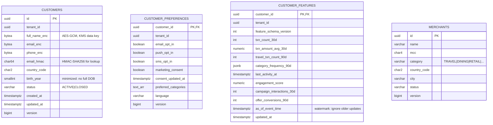
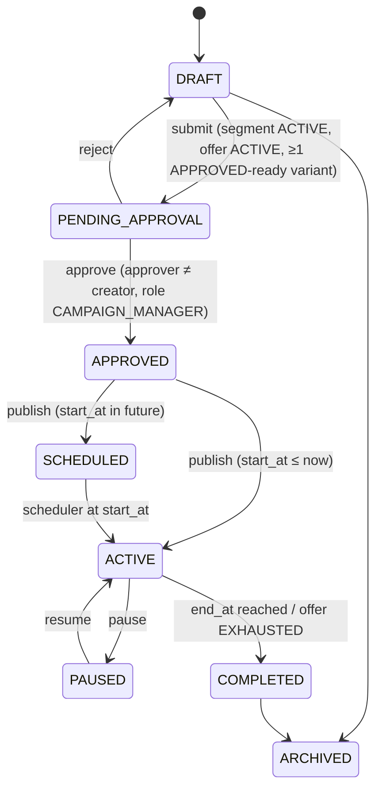

# Data Model

Status: Phase 0 design. The DDL is written as Flyway migrations in Phase 3. This document is the contract those migrations must satisfy.

## 1. Ownership and conventions

- **One PostgreSQL schema per service**, each with its own DB role. A role has `USAGE` only on its own schema, so cross-schema reads fail at the database, not just by convention ([ADR-015](decisions/ADR-015-postgres-schema-per-service.md)).
- **No foreign keys across schemas.** A cross-service reference is a UUID column with a `_id` suffix. Its validity is checked at write time through the owning service's API or event, never by FK.
- Every table has `tenant_id uuid not null` (the issuer/FI), except network-wide reference data (`merchants`). Every query in the application layer is tenant-scoped. PII tables additionally use **Postgres row-level security** keyed on `current_setting('app.tenant_id')` as defense in depth.
- Primary keys are `uuid` (UUIDv7, time-ordered for index locality). Timestamps are `timestamptz` in UTC.
- Aggregates carry `version bigint` for **JPA optimistic locking**. Conflicts map to `409 Conflict`.
- Every service schema contains the two technical tables `outbox_events` and `processed_events` (§9).
- High-volume append tables are **natively partitioned** by time and dropped by partition (no `DELETE`).
- Money is `numeric(19,4)` plus a `currency char(3)` column. Money is never a float.

## 2. ER overview (logical, across services)

Dashed relationships are cross-service ID references. They are not FKs.

```mermaid
erDiagram
  CUSTOMERS ||--o| CUSTOMER_PREFERENCES : has
  CUSTOMERS ||--o| CUSTOMER_FEATURES : "profile read model"
  MERCHANTS ||..o{ OFFERS : "merchant_id"
  SEGMENTS ||--o{ SEGMENT_MEMBERSHIPS : contains
  CUSTOMERS ||..o{ SEGMENT_MEMBERSHIPS : "customer_id"
  OFFERS ||--o{ OFFER_ELIGIBILITY_RULES : "governed by"
  OFFERS ||--o{ OFFER_ELIGIBILITY_DECISIONS : produces
  OFFERS ||--o{ OFFER_REDEMPTIONS : "redeemed as"
  CAMPAIGNS ||..|| SEGMENTS : "segment_id"
  CAMPAIGNS ||..|| OFFERS : "offer_id"
  CAMPAIGNS ||--o{ CONTENT_VARIANTS : has
  CAMPAIGNS ||--o{ CAMPAIGN_APPROVALS : "approved via"
  CAMPAIGNS ||..o{ VARIANT_ASSIGNMENTS : "campaign_id"
  CAMPAIGNS ||..o{ CAMPAIGN_METRICS : "campaign_id"
  CAMPAIGNS ||..o{ CAMPAIGN_EVENTS : "campaign_id"
  DOCUMENTS ||--o{ DOCUMENT_VERSIONS : versions
  DOCUMENT_VERSIONS ||--o{ CHUNKS : "split into"
  AI_REQUESTS ||..o{ TOOL_INVOCATIONS : "correlated"
  AGENT_RUNS ||--o{ TOOL_INVOCATIONS : calls
  CONVERSATIONS ||--o{ AGENT_RUNS : contains
  EVAL_RUNS ||--o{ EVAL_RESULTS : produces
```



## 3. customer-service (`customer` schema)



> **As implemented (Phase 2):** preferences and consent are columns of `customers`. They are 1:1 and always read together, so a separate table only added a join. `email_hmac` is keyed by tenant (HMAC over `tenantId:email`). Each PII ciphertext is bound through AES-GCM associated data to `customers:<tenant>:<id>:<column>`. `customer_features` arrives with the profile consumer in Phase 6.

Indexes: `customers(tenant_id, status)`, unique `customers(tenant_id, email_hmac)`, `merchants(category)`, `customer_features(tenant_id, last_activity_at)`.
RLS: enabled on `customers`, `customer_preferences`, `customer_features`.
Feature upserts are guarded: `... ON CONFLICT (customer_id) DO UPDATE ... WHERE customer_features.as_of_event_time < EXCLUDED.as_of_event_time`, so out-of-order profile events never regress state.

## 4. segmentation-service (`segment` schema)

| Table | Key columns | Notes |
|---|---|---|
| `segments` | `id`, `tenant_id`, `name` (unique per tenant), `description`, `definition jsonb` (rule DSL), `definition_version int`, `status` (DRAFT/ACTIVE/RETIRED), `estimated_size`, `origin` (MANUAL/AI_PROPOSED), `created_by`, `version` | The DSL is validated against a JSON Schema and compiled to a predicate over allow-listed feature names. It is never compiled to raw SQL fragments from user input. |
| `segment_memberships` | PK `(segment_id, customer_id)`, `tenant_id`, `joined_at`, `left_at null`, `definition_version` | Partial index `WHERE left_at IS NULL` for active members. Paged by `customer_id` keyset. |
| `feature_projection` | PK `customer_id`, `tenant_id`, typed feature columns, `as_of_event_time` | Local CQRS projection of `customer.profile.updated` (compacted topic). Used for backfill when a segment is activated. |

Example DSL:
```json
{"all":[{"feature":"travel_txn_count_90d","op":"gte","value":3},
        {"feature":"txn_amount_avg_30d","op":"gte","value":80},
        {"feature":"marketing_consent","op":"eq","value":true}]}
```

## 5. offer-service (`offer` schema)

| Table | Key columns | Notes |
|---|---|---|
| `offers` | `id`, `tenant_id`, `merchant_id`, `title`, `description`, `category`, `offer_type` (CASHBACK_PERCENT/CASHBACK_FIXED/DISCOUNT), `value numeric(19,4)`, `currency`, `min_spend`, `max_reward`, `per_customer_cap`, `total_budget`, `start_at`, `end_at`, `status` (DRAFT/ACTIVE/PAUSED/EXPIRED/EXHAUSTED), `terms_document_id`, `version` | CHECK: `end_at > start_at`, `value > 0`. `terms_document_id` references a RAG document. |
| `offer_eligibility_rules` | `id`, `offer_id` FK, `rule_type` (SEGMENT_IN, COUNTRY_IN, MIN_TXN_COUNT_30D, CONSENT_REQUIRED, EXCLUDE_IF_REDEEMED, CATEGORY_AFFINITY_MIN), `params jsonb`, `priority`, `rule_set_version` | Closed set of rule types, each implemented as a Java class. No expression evaluation of arbitrary strings. |
| `offer_eligibility_decisions` | `id`, `tenant_id`, `offer_id`, `customer_id`, `eligible bool`, `reason_codes text[]`, `rule_set_version`, `decided_at`, `trigger_event_id` | **Partitioned monthly**. 13-month retention. This is the audit trail that proves why a customer did or did not receive an offer. |
| `budget_ledger` | `id`, `offer_id`, `entry_type` (RESERVE/COMMIT/RELEASE), `amount`, `reference_id` UNIQUE, `created_at` | Append-only. The balance is a sum. `reference_id` uniqueness makes conversion-driven commits idempotent. |
| `offer_redemptions` | `id`, `offer_id`, `customer_id`, `conversion_event_id` UNIQUE, `amount`, `reward`, `redeemed_at` | |

## 6. campaign-service (`campaign` schema)



| Table | Key columns | Notes |
|---|---|---|
| `campaigns` | `id`, `tenant_id`, `name`, `objective`, `status`, `segment_id`, `offer_id`, `start_at`, `end_at`, `budget_amount`, `currency`, `origin` (MANUAL/AI_ASSISTED), `ai_request_id null`, `created_by`, `published_by`, `published_at`, `created_at`, `updated_at`, `version` | Unique `(tenant_id, name)`. Index `(tenant_id, status, start_at)`. |
| `campaign_channels` | PK `(campaign_id, channel)` | EMAIL / PUSH / IN_APP / SMS |
| `content_variants` | `id`, `campaign_id` FK, `channel`, `variant_key`, `language`, `subject`, `body_template` (slot syntax `{{offer.value}}`), `status` (DRAFT/COMPLIANCE_PASSED/COMPLIANCE_FAILED/APPROVED/REJECTED), `generated_by` (HUMAN/AI), `prompt_id`, `prompt_version`, `model_id`, `compliance_report jsonb`, `version` | Slots may reference only an allow-list (`customer.firstName`, `offer.*`, `merchant.name`). They are filled at send time from authoritative data. |
| `campaign_approvals` | `id`, `campaign_id` FK, `decision` (APPROVE/REJECT), `decided_by`, `comment`, `decided_at` | CHECK enforced in the application with a DB trigger backstop: `decided_by <> campaigns.created_by`. |

## 7. Other service schemas

**personalization** — `campaign_activations(campaign_id PK, status, cursor_customer_id, processed_count, started_at, completed_at)` makes activation resumable after a crash. `variant_assignments(campaign_id, customer_id, variant_id, assigned_at, mode (TEMPLATE|REALTIME_AI|FALLBACK), PK(campaign_id, customer_id))` keeps assignment sticky and gives one message per customer per campaign.

**notification** — `notification_log(id, tenant_id, request_id UNIQUE, customer_id, campaign_id, channel, status, suppressed_reason, sent_at)` partitioned monthly, 13 months. `frequency_counters` live in Redis. The daily count is rebuilt from `notification_log` if Redis is lost.

**analytics**
| Table | Notes |
|---|---|
| `campaign_metrics` | PK `(campaign_id, segment_id, channel, bucket_start)`, hourly buckets: `impressions, deliveries, opens, clicks, conversions bigint`, `conversion_amount, cost numeric`. Upserted from `campaign.metrics` (the stream emits the full bucket value, so the upsert is idempotent). Partitioned monthly. |
| `campaign_daily_metrics` | Materialized rollup (refreshed incrementally) for fast dashboards and comparisons. |
| `campaign_events` | Engagement/conversion events, 35-day partitions (daily). Used for drill-down and for reconciling stream aggregates. Long-term history lives in the lake. |
| `campaign_dim` | Projection of `campaign.events` (name, segment, offer, dates, status) so analytics can join without calling campaign-service. |

Derived metrics are computed in SQL, never stored: CTR = clicks/impressions, CVR = conversions/clicks, engagement rate = (opens+clicks)/deliveries, CPA = cost/conversions. Division by zero → `null`, not 0.

**audit** — `audit_events(id, event_id UNIQUE, tenant_id, occurred_at, actor_type (USER|SERVICE|AGENT), actor_id, on_behalf_of, action, resource_type, resource_id, outcome, correlation_id, trace_id, details jsonb, prev_hash, hash)` partitioned monthly. The DB role has `INSERT, SELECT` only. `hash = SHA-256(prev_hash || canonical(event))` per partition chain, and a verification job re-computes the chain. `details` must pass a PII scrubber. 7-year retention in S3 Object Lock (compliance mode), 13 months in Postgres.

**aigw** (ai-gateway) — `ai_requests(id, tenant_id, correlation_id, trace_id, user_id, use_case, campaign_id null, prompt_id, prompt_version, provider, model, model_version, route_reason, input_tokens, output_tokens, cached_input_tokens, cost_usd numeric(12,6), latency_ms, ttft_ms, status, error_code, fallback_used, schema_valid, repair_attempts, egress_policy_result, prompt_sha256, created_at)` partitioned monthly. Model price table: `model_prices(provider, model, effective_from, input_per_mtok, output_per_mtok, cached_input_per_mtok)` is config-loaded, so historical costs remain reproducible.

**orchestrator**
| Table | Notes |
|---|---|
| `conversations` | `id, tenant_id, user_id, title, created_at, last_active_at, expires_at (30d)`. Messages live in Redis (§8) and summaries here. No raw PII is stored. |
| `agent_runs` | `id, conversation_id, graph, graph_version, intent, status, degraded, started_at, finished_at, total_latency_ms, total_cost_usd`, `steps jsonb` (node, latency, outcome; no payloads) |
| `tool_invocations` | `id, run_id, tool, mcp_server, authorized bool, deny_reason, args_sha256, status, latency_ms, retries` |
| `graph_checkpoints` | `run_id, step, state bytea (encrypted), created_at`. Enables resuming after a human-in-the-loop interrupt. 7-day TTL. |
| `user_memories` | `id, tenant_id, user_id, kind (PREFERENCE)`, `key, value` (allow-listed keys only, e.g. `preferred_chart_type`, `default_channel`), `source_run_id, approved_at, expires_at (180d), deleted_at` |

**rag**
| Table | Notes |
|---|---|
| `documents` | `id, tenant_id (null = platform-wide), title, document_type (POLICY/GUIDELINE/PRODUCT/OFFER_TERMS/BRAND/COMPLIANCE/FAQ/CAMPAIGN_DOC), business_domain, access_level (PUBLIC/INTERNAL/CONFIDENTIAL/RESTRICTED), allowed_roles text[], source_uri, current_version, status, created_at, updated_at` |
| `document_versions` | PK `(document_id, version)`, `sha256` (unique per document: identical re-upload is a no-op), `s3_key, status (INGESTING/ACTIVE/SUPERSEDED/FAILED), effective_from, ingested_at, parser, chunker_version, embedding_model` |
| `chunks` | `id, document_id, version, ordinal, heading_path, text, token_count, metadata jsonb, tsv tsvector GENERATED`. GIN index on `tsv`. **Authoritative text.** The fallback keyword search runs here. |

**evaluation** — `eval_datasets(id, name, version, sha256)` (cases live in git under `ai/datasets/`, and the DB stores the pinned hash). `eval_runs(id, dataset_id, git_sha, target jsonb {prompt versions, models, retrieval strategy}, trigger (PR/NIGHTLY/MANUAL/ONLINE), status, started_at, finished_at, cost_usd)`. `eval_results(run_id, case_id, metrics jsonb, passed, failure_reasons text[])` — this is the requested `ai_evaluations`. `eval_baselines(dataset_id, metric, value, run_id, approved_by, approved_at)`.

## 8. Redis key design (never authoritative)

| Key pattern | Purpose | TTL | Loss impact |
|---|---|---|---|
| `rl:{clientId}:{route}` | Gateway token bucket | 1–60 s | Limits reset briefly |
| `idem:{service}:{key}` | Idempotency fast path: in-flight lock + cached response (hash of request body) | 24 h | Duplicate request falls through to the DB-level guard (unique constraint / state machine) |
| `cust:profile:{tenantId}:{customerId}` | Profile + features cache | 5 min, evicted on `customer.profile.updated` | Read from DB |
| `offer:catalog:{tenantId}:{category}` | Active offers | 60 s, evicted on `offer.events` | Read from DB |
| `conv:{conversationId}:msgs` | Short-term conversation memory (last N turns, redacted) | 24 h sliding | Conversation context lost; the user can restate |
| `aicache:{useCase}:{sha256}` | Exact-match LLM response cache (only non-personalized, temperature 0 use cases) | per use case, 1–24 h | Extra LLM cost |
| `emb:{model}:{sha256(text)}` | Query embedding cache | 24 h | Extra embedding compute |
| `freq:{customerId}:{yyyyMMdd}` | Notification frequency cap | 48 h | Rebuilt from `notification_log` |
| `tool:rl:{userId}:{tool}` | Per-user tool rate limit | 60 s | |

## 9. Technical tables (every service schema)

```sql
create table outbox_events (
  id             uuid primary key,          -- = eventId in the envelope
  aggregate_type varchar(64)  not null,
  aggregate_id   varchar(64)  not null,     -- becomes the Kafka key
  topic          varchar(128) not null,
  event_type     varchar(128) not null,
  schema_version int          not null,
  payload        bytea        not null,     -- Avro-serialized envelope
  headers        jsonb        not null,     -- correlationId, traceparent, tenantId
  created_at     timestamptz  not null default now(),
  published_at   timestamptz
);
create index outbox_unpublished on outbox_events (created_at) where published_at is null;

create table processed_events (
  consumer_group varchar(128) not null,
  event_id       uuid         not null,
  processed_at   timestamptz  not null default now(),
  primary key (consumer_group, event_id)
);  -- purged after 14 days (> max topic retention)
```

## 10. OpenSearch indices

| Index (alias) | Content | Mapping highlights |
|---|---|---|
| `knowledge-chunks` → `knowledge-chunks-{embeddingModel}-{n}` | RAG chunks | `text` (BM25, english analyzer), `embedding` (knn_vector, dim per model, HNSW, cosine), keyword fields: `tenant_id, document_id, version, document_type, business_domain, access_level, allowed_roles, status, effective_from`. Changing the embedding model = new index + re-embed + alias swap. |
| `semantic-memory` | Approved long-term user memories (embedded) | Filter `tenant_id` + `user_id` on every query |

## 11. Data lake (S3; LocalStack S3 locally)

```
s3://vasmkt-{env}-lake/
  raw/{topic}/dt=YYYY-MM-DD/hr=HH/*.parquet      # Kafka Connect sink, as-is, schema id retained; 90 d
  curated/transactions/dt=…/                      # deduped by eventId, typed, merchant-enriched, no PII; 2 y
  curated/engagement/dt=…/
  curated/customer_features_daily/dt=…/           # daily snapshot for backfill & ML
  quarantine/{topic}/dt=…/                        # rows failing data-quality checks
  audit-archive/…                                 # Object Lock, 7 y
```

**Data-quality checks** run in the curation job and publish results as metrics: schema conformance, `eventId` uniqueness, non-null keys, `amount ≥ 0`, `occurredAt` within [now − 30 d, now + 5 min], referential check `merchantId ∈ merchants`. Failures go to `quarantine/`, and an alert fires when a day's quarantine ratio exceeds 0.5 %.

**Lineage**: each curated row carries `source_topic, source_partition, source_offset, ingestion_run_id`. Each run writes a manifest (`_manifest.json`) with input partitions, row counts, rejects and code version.

**Lifecycle**: raw → S3 IA after 30 d, expire at 90 d. Curated → IA after 90 d, Glacier IR after 1 y, expire at 2 y. Audit archive is retained 7 y under Object Lock.
