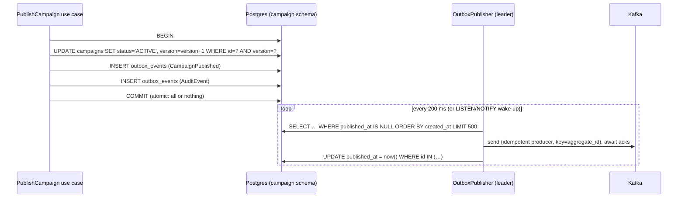

# Kafka & Event Architecture

Status: Phase 0 design. See [ADR-002](decisions/ADR-002-kafka-event-backbone.md), [ADR-003](decisions/ADR-003-transactional-outbox.md), [ADR-013](decisions/ADR-013-avro-schema-registry.md) and [ADR-014](decisions/ADR-014-kafka-streams.md).

## 1. Event metadata

> **As implemented (Phase 4):** the metadata below is an embedded `metadata` record (`EventMetadata`) in every event, not an outer envelope. The domain payload fields sit next to it. Schemas are in `platform/event-schemas`.

All events are Avro records carrying common metadata. Kafka **headers** duplicate the routing and tracing fields, so infrastructure (DLQ tooling, tracing, Connect) can read them without deserializing.

| Field | Type | Purpose |
|---|---|---|
| `eventId` | UUID | Global dedup key (consumer idempotency) |
| `eventType` | string | e.g. `CampaignPublished` |
| `schemaVersion` | int | Payload schema major version |
| `source` | string | Producing service |
| `tenantId` | UUID | Issuer/FI |
| `occurredAt` | timestamp-millis | **Event time** (business time), used for windowing |
| `producedAt` | timestamp-millis | Processing/produce time |
| `correlationId` | string | Request correlation across hops |
| `causationId` | UUID? | eventId that caused this one |
| `payload` | union/record | Event-specific body |

Headers: `traceparent`, `tracestate`, `x-correlation-id`, `x-tenant-id`, `x-event-type`. On DLQ, additional headers are added: `x-dlq-reason`, `x-dlq-exception`, `x-dlq-original-topic/partition/offset`, `x-dlq-attempts`.

Producers: `enable.idempotence=true`, `acks=all`, `max.in.flight.requests.per.connection=5`, `compression.type=zstd`, `linger.ms=5–20`.

## 2. Topic catalog

Partition counts are **prod / local**. Prod RF=3, `min.insync.replicas=2`. Local RF=1.

| Topic | Key | Producer | Consumers (group) | Partitions | Retention / cleanup | Why this key |
|---|---|---|---|---|---|---|
| `transaction.events` | customerId | event-ingestion-service | stream-processor (`sp-features`, `sp-attribution`), kafka-connect (`lake-sink`) | 24 / 3 | 7 d, delete | Per-customer ordering for features and attribution. Co-partitioned with the other customer-keyed topics |
| `customer.events` | customerId | event-ingestion-service | stream-processor, lake-sink | 24 / 3 | 7 d | Same state (customer features) as transactions, so they are co-partitioned for joins |
| `engagement.events` | customerId | notification-service, event-ingestion-service (click beacons) | stream-processor, analytics-service (`ana-events`), lake-sink | 24 / 3 | 7 d | Customer-level features (interactions) and attribution join with transactions need co-partitioning. Campaign aggregation re-keys (§5.3) |
| `merchant.reference` | merchantId | customer-service (outbox) | stream-processor (GlobalKTable) | 6 / 1 | **compact** | Latest state per merchant. A GlobalKTable replicates it to every instance, so it needs no co-partitioning |
| `customer.profile.updated` | customerId | stream-processor | customer-service (`cus-profile`), segmentation-service (`seg-profile`), lake-sink | 24 / 3 | **compact**, `min.compaction.lag.ms`=1 h | Latest feature state per customer. Compaction makes the topic a full table for backfill/bootstrap |
| `segment.membership.changed` | customerId | segmentation-service (outbox) | offer-service (`off-membership`), personalization-service | 24 / 3 | 7 d | Join/leave events for the same customer must stay ordered |
| `offer.events` | offerId | offer-service (outbox) | personalization-service (cache eviction), analytics (dims) | 6 / 1 | 30 d | Lifecycle order per offer. Low volume |
| `offer.eligibility.determined` | customerId | offer-service (outbox) | personalization-service (`per-eligibility`) | 24 / 3 | 3 d | Per-customer decision order |
| `campaign.events` | campaignId | campaign-service (outbox) | personalization-service (`per-activation`), analytics (`ana-campaign-dim`) | 6 / 1 | 30 d | **All lifecycle transitions of one campaign in order.** `CampaignPublished` must never overtake `CampaignApproved` |
| `notification.requests` | customerId | personalization-service | notification-service (`not-send`) | 24 / 3 | 3 d | Frequency caps are evaluated per customer, so they must be serialized per key |
| `campaign.conversion` | customerId | stream-processor (attribution) | analytics-service, offer-service (budget/redemption), stream-processor (features) | 24 / 3 | 30 d | Follows the customer. Consumers needing campaign scope carry campaignId in the payload |
| `campaign.metrics` | `campaignId|segmentId|channel|bucketStart` | stream-processor | analytics-service (`ana-metrics`) | 12 / 3 | 7 d, **compact+delete** | Each message is the full value of a bucket. Compaction keeps only the latest. Idempotent upsert downstream |
| `stream.late.events` | original key | stream-processor | lake-sink (batch correction) | 6 / 1 | 14 d | Events beyond the grace period (see §5.2) |
| `ai.events` | requestId | ai-gateway | evaluation-service (`eval-online`), audit-service, lake-sink | 6 / 1 | 7 d | `AiRequested` → `AiCompleted/AiFailed` ordered per request |
| `audit.events` | resourceId | all services (outbox) | audit-service (`aud-store`), lake-sink | 12 / 3 | 30 d | Audit chain order per resource |
| `knowledge.document.events` | documentId | rag-service | rag-service ingest workers (`rag-ingest`) | 6 / 1 | 7 d | Versions of one document are ingested sequentially |
| `<topic>.dlq` | original key | error handlers | ops replay tool | same as source | 30 d | Preserve the key so a replay keeps ordering semantics |
| `<topic>.<group>.retry-{n}` | original key | Spring Kafka `@RetryableTopic` | same group | same | 1 d | Only for **order-insensitive** consumers (§4) |

### 2.1 Partition sizing

`partitions ≥ max(peak_msgs_per_sec / sustainable_msgs_per_sec_per_consumer, max_consumer_instances) × headroom(2×)`.

Partitions can be added but never removed, and **adding partitions remaps keys**. That breaks per-key ordering and Kafka Streams co-partitioning during the change. So keyed topics are sized for 2–3 years of growth up front.

**All customer-keyed topics have the same count (24).** The feature and attribution topologies join or merge `transaction.events`, `customer.events`, `engagement.events` and `campaign.conversion` by customerId. With equal counts and the same default partitioner, they are co-partitioned and need no internal repartition topic. 24 partitions allow up to 24 parallel consumer instances. At a conservative ~3–5 k msgs/s per Streams task, that is ~70–120 k msgs/s, far above the synthetic peak. Phase 17 measures the real per-task figure and revisits the number before any production claim.

Low-volume, entity-keyed control-plane topics (`campaign.events`, `offer.events`) use 6 partitions. Their throughput is tiny, and the count only bounds consumer parallelism.

### 2.2 Mapping from the requested topic names

| Requested | Implemented as | Reason |
|---|---|---|
| `campaign.created`, `campaign.published` | `CampaignCreated`, `CampaignPublished` event types on `campaign.events` | Separate topics cannot guarantee cross-topic order for one campaign |
| `offer.clicked` | `engagement.events` with `eventType=CLICK`, `offerId`, `campaignId` | Clicks, opens and impressions share consumers and key |
| `campaign.conversion` | kept as-is | Produced by attribution, a different producer and semantics |
| `ai.requested`, `ai.completed` | `AiRequested`, `AiCompleted`, `AiFailed` on `ai.events` | Per-request ordering. Orphaned requests are detectable |
| `campaign.events`, `offer.events`, `customer.events`, `transaction.events`, `customer.profile.updated`, `audit.events` | kept as-is | |

## 3. Transactional outbox

Problem: `save(campaign); kafka.send(CampaignPublished)` is a dual write. A crash between the two, or a Kafka outage, leaves the database and the event stream inconsistent: a published campaign that never activates, or an event for a rolled-back campaign.



- **Delivery semantics: at-least-once.** A crash after send and before the update republishes the event. Consumers dedup by `eventId`.
- **Storage:** rows hold the event as registry-free Avro binary plus its generated class name (restricted to `com.vasmarketing.events.*`). So a Schema Registry outage delays publishing but never blocks business writes.
- **Ordering:** a single active publisher per service. Each batch runs in a transaction holding `pg_try_advisory_xact_lock(hash(service))`, so there is no extra library or lease table. Other instances skip while the leader holds the lock. A failed send stops the batch so later events never overtake it.
- *(Original design, superseded:* ShedLock leader lease in Postgres*)* reads in `created_at, id` order. Multi-instance `SKIP LOCKED` was rejected because two instances can publish the same aggregate's events out of order.
- **Throughput:** a single publisher with batching handles a few thousand events/s. That is well above control-plane write rates (campaign/offer/segment changes). Debezium CDC is the documented upgrade path ([ADR-003](decisions/ADR-003-transactional-outbox.md)).
- **Housekeeping:** published rows are deleted after 3 days. Alerts fire on `outbox_oldest_unpublished_age_seconds > 60`.

## 4. Consumer error handling

| Consumer class | Examples | Strategy |
|---|---|---|
| **Order-sensitive** (keyed state) | segmentation (`seg-profile`), offer (`off-membership`), notification (`not-send`), personalization (`per-activation`) | **Blocking** retry in place: `DefaultErrorHandler` with `ExponentialBackOff` (1 s → 2 s → 4 s → 8 s → 16 s, 5 attempts), then publish to `<topic>.dlq` and commit. Non-retryable exceptions (validation, deserialization) go straight to the DLQ |
| **Order-insensitive** | analytics sinks, audit store, lake | **Non-blocking** retry topics (`@RetryableTopic`, 3 attempts, 1 s/10 s/60 s) → DLQ. The partition keeps flowing |
| Kafka Streams | stream-processor | `DeserializationExceptionHandler` → DLQ. `ProductionExceptionHandler` → fail (EOS). `StreamsUncaughtExceptionHandler` → `REPLACE_THREAD` with alerting |

**Idempotent processing**: order-sensitive consumers write `processed_events(consumer_group, event_id)` **in the same DB transaction** as their state change. A duplicate hits the PK and is skipped. Offsets are committed after the DB commit (`AckMode.RECORD`/`BATCH` + manual), so the sequence is DB commit, then offset commit. Redelivery is harmless.

**Backpressure**: `max.poll.records` is tuned per group (e.g. 100 for eligibility, 500 for sinks). Downstream calls sit behind Resilience4j bulkheads. When a downstream circuit is open, the listener container is **paused** (not spun), and resumes when the circuit half-opens. Lag grows visibly instead of burning retries.

**DLQ operations**: an admin endpoint/CLI `dlq replay --topic X --from-offset --filter eventType` republishes to the original topic after a fix. Replays are audited.

**Lag monitoring**: kafka-exporter (local) / MSK Open Monitoring + CloudWatch. Alert when a critical group has lag > 10 k for 5 min or the consumer time lag exceeds 60 s.

## 5. Streaming topologies (stream-processor)

Kafka Streams, `processing.guarantee=exactly_once_v2`, RocksDB state with changelog topics, `num.standby.replicas=1` in prod.

### 5.1 Feature topology (`sp-features`)

```
transaction.events ─┐
customer.events  ───┼─► dedup(eventId, 48h window store) ─► enrich(merchant GlobalKTable: category)
engagement.events ──┘       │
campaign.conversion ────────┘
        ─► DailyBucketProcessor (key=customerId; store: last 90 daily buckets, event-time)
        ─► compute rolling features on change ─► suppress (emit at most every 2 s per key)
        ─► customer.profile.updated
```

- **Event time:** a custom `TimestampExtractor` reads `occurredAt`.
- **Late events:** an event updates its own daily bucket if `occurredAt ≥ streamTime − 48 h` (grace). Older events go to `stream.late.events`, and the nightly lake job recomputes `customer_features_daily`, which reconciles the difference.
- **Future-dated events** (> 5 min ahead) are rejected to the DLQ with reason `CLOCK_SKEW`.
- **Features:** `txn_count_30d`, `txn_amount_avg_30d`, `travel_txn_count_90d`, `category_frequency_90d` (map), `last_activity_at`, `engagement_score` (exponentially decayed interactions, half-life 14 d), `campaign_interactions_30d`, `offer_conversions_90d`.
- Why a custom bucket processor instead of 30-day hopping windows: a hopping window with a 1-day advance keeps 30 overlapping windows per key. Daily buckets keep 90 small records and compute any rolling range.

### 5.2 Attribution topology (`sp-attribution`)

`engagement.events[CLICK]` ⋈ `transaction.events` on customerId, within **0–7 days after click** (stream-stream join window, grace 24 h). Predicate: `txn.merchantId == click.merchantId` (click events carry `offerId`, `campaignId` and `merchantId`, enriched at send time). The model is last-click. Dedup is one conversion per `(offerId, transactionEventId)`. Output goes to `campaign.conversion`.

Both inputs are keyed by customerId with equal partition counts (§2.1), so the join needs no repartition. Join state (7-day window of clicks per customer) is bounded: clicks are orders of magnitude rarer than transactions.

### 5.3 Campaign metrics topology (`sp-metrics`)

A large campaign concentrates on one `campaignId` key, which creates a **hot partition**. So the topology uses a two-stage aggregation:
1. **Local pre-aggregation**, keyed by `customerId`-partition. Tumbling 1-minute windows are aggregated to `(campaignId, segmentId, channel, minute)` partial counts. There is no repartition yet.
2. **Re-key** to `campaignId|segmentId|channel`. Hourly tumbling windows (grace 2 h) sum the partials. Only ~1 message per partition per minute crosses the repartition topic, regardless of campaign size.
3. `emit` updates (not suppressed until close), so dashboards are near-real-time. The final value wins through compaction and upsert.

## 6. Schema evolution

- Avro schemas live in `platform/event-schemas/src/main/avro/`. Classes are generated at build time.
- Registry subject strategy: **`TopicNameStrategy`** (`<topic>-value`), with **one record type per topic**. The kind of change is an enum field with a default (`transition`, `change`), and each event carries a state snapshot so consumers never call back. *(Changed from the original TopicRecordNameStrategy plan: one schema per subject keeps compatibility checks, tooling and consumers simple.)*
- The build exports each topic's full schema exactly as serializers register it (`RegistrySchemas`, nested records inlined). `make schemas-check` and the CI `schemas` job test it against the registry. CI first registers `main`'s schemas as the baseline, so an incompatible change fails the PR. A deliberately breaking change was verified to fail with `READER_FIELD_MISSING_DEFAULT_VALUE`.
- Compatibility: **BACKWARD_TRANSITIVE**. New readers read all old data. Allowed: add a field with a default, remove a field that had a default. Not allowed without a new major version: renaming, type changes, removing required fields.
- A **breaking change** means a new event type version (`CampaignPublishedV2`), a dual-publish period, consumer migration, then retirement of the old type. Topic names do not carry a version.
- Producers in shared environments run with `auto.register.schemas=false` (`KAFKA_AUTO_REGISTER_SCHEMAS`), so only CI registers new versions.

## 7. Security

- MSK: TLS in transit, **IAM auth** (SASL/IAM) per service role. Topic-level ACLs mean a producer can write only its owned topics and consumers can read only the topics they subscribe to (IAM policy conditions on topic ARNs).
- Local: PLAINTEXT on the private compose network (documented as local-only).
- Payloads contain no PII beyond `customerId` (a pseudonymous UUID). Contact data never enters Kafka.
