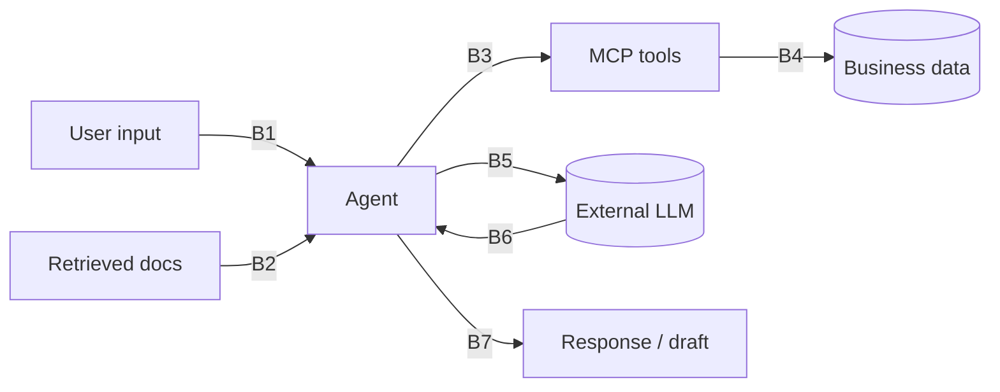

# Security Architecture & Threat Model

Status: Phase 0 design. See [ADR-017](decisions/ADR-017-keycloak-token-exchange.md). Authentication and RBAC are built from Phase 3 onward, not deferred to Phase 13 (see [roadmap.md](roadmap.md)).

## 1. Identity and authentication

| Principal | Mechanism |
|---|---|
| Human users | OIDC Authorization Code + PKCE (SPA) against Keycloak. Access token (JWT, 5 min) + refresh token (rotating, 8 h session) |
| Services | OAuth2 client credentials, one Keycloak client per service (secret from Secrets Manager / K8s Secret; private-key JWT in prod) |
| Agents acting for a user | **RFC 8693 token exchange**: the orchestrator exchanges the user's token for a down-scoped token (`aud=marketing-mcp`, scopes ⊆ user's permissions ∩ agent allow-list, 2 min TTL, `act` claim = `ai-orchestrator`) |
| External MCP clients | OAuth 2.1 (authorization code + PKCE, dynamic client registration disabled, pre-registered clients only) |
| Event producers (ingestion API) | Client credentials per source system + HMAC request signature + timestamp (replay window 5 min) |

JWTs are validated at the **gateway and again in every service** (issuer, audience, expiry, signature via cached JWKS). The gateway is not trusted as the only check.

## 2. Authorization (RBAC → permissions)

Roles are Keycloak realm roles mapped to fine-grained permissions in code (`@PreAuthorize("hasAuthority('campaign:approve')")`). Tenant comes from the `tenant_id` claim and scopes every query.

| Permission | MARKETING_ADMIN | CAMPAIGN_MANAGER | MARKETING_ANALYST | DATA_ANALYST | AI_OPERATOR | READ_ONLY |
|---|:-:|:-:|:-:|:-:|:-:|:-:|
| campaign:read | ✔ | ✔ | ✔ | ✔ | | ✔ |
| campaign:draft (create/edit) | ✔ | ✔ | | | | |
| campaign:submit | ✔ | ✔ | | | | |
| campaign:approve (≠ creator) | ✔ | ✔ | | | | |
| campaign:publish / pause | ✔ | ✔ | | | | |
| offer:read | ✔ | ✔ | ✔ | ✔ | | ✔ |
| offer:write | ✔ | | | | | |
| segment:read | ✔ | ✔ | ✔ | ✔ | | ✔ |
| segment:write | ✔ | ✔ | | ✔ | | |
| customer:profile:read (masked) | ✔ | | | ✔ | | |
| customer:contact:read (PII) | — (service role `notification-service` only) | | | | | |
| analytics:read | ✔ | ✔ | ✔ | ✔ | | ✔ |
| knowledge:read (+doc ACL) | ✔ | ✔ | ✔ | ✔ | ✔ | ✔ |
| knowledge:write | ✔ | | | | ✔ | |
| ai:chat / ai:generate | ✔ | ✔ | ✔ | ✔ | ✔ | |
| ai:admin (prompts, routing, baselines, evals) | | | | | ✔ | |
| ai:telemetry:read | ✔ | | | | ✔ | |
| audit:read | ✔ | | | | ✔ (AI events) | |

Enforcement layers: **API** (method security), **service** (use-case checks such as four-eyes and tenant ownership), **data** (tenant predicates, Postgres RLS on PII tables, DB roles per schema) and **retrieval** (OpenSearch filter on `tenant_id`, `allowed_roles`, `access_level`). The frontend hides actions for UX only.

## 3. Transport, encryption and secrets

- TLS 1.2+ at the ALB (ACM certs). In-cluster mTLS through Linkerd (prod/staging). Local compose uses plaintext on a private network, documented.
- At rest: RDS, ElastiCache, MSK, OpenSearch, S3 and EBS encrypted with **KMS CMKs** per data domain. PII columns use application-level envelope encryption (AES-256-GCM data key wrapped by KMS; locally a key from an env var, never committed).
- Secrets: AWS Secrets Manager → External Secrets Operator → K8s Secrets (referenced, never inlined in manifests). IRSA gives each pod its own IAM role. No long-lived AWS keys.
- Images contain no secrets. gitleaks runs in CI and as a pre-commit hook. `.env.example` has placeholders only.
- Edge: AWS WAF managed rule sets (common, known bad inputs, IP reputation) + rate-based rules. Gateway per-client token buckets. Request body limits (1 MB API, 20 MB document upload).

## 4. Data privacy

- **Classification** annotations on fields (`@DataClass(PII)`) drive log masking, API response masking and the AI egress policy ([ai-architecture.md §2.5](ai-architecture.md)).
- **Minimization**: birth year instead of DOB. `customer_id` is a pseudonym everywhere outside customer-service. Contact PII never goes on Kafka, into the lake, into prompts or into memory.
- **Tokenization**: `email_hmac` for lookups without decryption. Synthetic PANs never stored; transaction events carry a token reference only.
- **Retention**: see data-model.md per table. Customer erasure: customer-service deletes/crypto-shreds PII (destroys the per-customer data key), emits `CustomerErased`, and consumers purge projections.
- **Audit**: every PII read (contact endpoint) is audited with purpose.

## 5. Threat model (STRIDE-oriented)

| # | Threat | Vector | Mitigations |
|---|---|---|---|
| T1 | Credential stuffing / brute force | Login | Keycloak brute-force detection, MFA for admin roles, WAF rate rules |
| T2 | Token theft / replay | XSS, logs, network | Short-lived access tokens, PKCE, no tokens in localStorage (in-memory + refresh via secure cookie BFF option), CSP, tokens never logged, TLS |
| T3 | Authorization bypass (IDOR) | Guessing IDs of other tenants' campaigns | Tenant predicate on every repository query, RLS on PII, tests that assert 404 across tenants |
| T4 | Privilege escalation via AI | Asking the agent to do what the user can't | Token exchange: agent token ⊆ user permissions; MCP + domain services re-check |
| T5 | Four-eyes bypass | Creator approves own campaign | Service rule + DB trigger + audit |
| T6 | API abuse / scraping | Automated clients | Gateway rate limits, WAF, pagination caps (max 100), anomaly alerts |
| T7 | Replay of ingestion events | Re-sending signed payloads | HMAC with timestamp window, `eventId` dedup |
| T8 | Duplicate or replayed commands | Retries on publish | Idempotency keys, state machine guards |
| T9 | Kafka tampering / eavesdropping | Rogue producer | MSK IAM auth, topic-level policies per service, TLS, schema validation |
| T10 | Database compromise via a service | SQL injection, stolen creds | JPA parameterized queries, per-schema least-privilege roles, Secrets Manager rotation, no DB access from AI |
| T11 | Supply chain | Malicious dependency/image | Dependency pinning via BOM, OWASP dependency-check + GitHub dependency review, Trivy, SBOM (CycloneDX), signed images (cosign), base images pinned by digest |
| T12 | Secret leakage | Commit, image, logs | gitleaks, no secrets in images, log masking |
| T13 | Audit tampering | Insider edits audit rows | Insert-only role, hash chain + verification job, S3 Object Lock |
| T14 | Denial of wallet | Flooding AI endpoints | Per-user AI rate limits, tenant budgets, max tokens per use case |

## 6. AI threat model

| Boundary | Threat | Control (enforced in code) |
|---|---|---|
| B1 | Direct prompt injection, jailbreak | Input guard (heuristics + classifier), intent allow-list, bounded graph; the model can't expand its own tool set |
| B2 | Indirect injection via documents/tool output | Ingestion scan + quarantine, untrusted-data delimiters, **tool calls derived from the plan, never from retrieved text**, write access for documents restricted to admins |
| B3 | Unauthorized or malicious tool calls | Allow-list ∩ RBAC, JSON Schema args, tenant ownership check, no SQL/URL/path args, no side-effecting tools beyond drafts, rate limits, audit |
| B4 | Data exfiltration through tools | Masked/aggregate-only customer tools, k-anonymity (k ≥ 20) on breakdowns, result size caps, confused-deputy protection (token exchange, no token passthrough) |
| B5 | Sensitive data sent to provider | Egress policy per data class, PII detector/redactor, provider allow-list per class, zero-retention agreements documented |
| B6 | Hallucinated facts, malformed output | Schema validation, numeric and citation grounding, deterministic facts separated from interpretation |
| B7 | Unsafe/non-compliant content reaching customers | Compliance rule pack + independent reviewer + **mandatory human approval** before publish; send-time content is template-filled from authoritative data |
| All | System prompt extraction | Canary token detection; system prompts contain no secrets or authorization logic |

Principle restated: **the system prompt is not a security boundary.** Every control above works even if the model follows an attacker's instructions perfectly.

## 7. Security testing

- Unit/integration: role matrix tests per endpoint (generated from the table above), cross-tenant access tests, four-eyes tests.
- AI: the `adversarial` golden dataset runs in CI (attack success must be 0 on critical cases).
- CI: CodeQL, dependency review, OWASP dependency-check (fail on CVSS ≥ 7 without an approved suppression with expiry), Trivy image scan (fail on HIGH/CRITICAL with fix available), gitleaks, checkov on Terraform/K8s.
